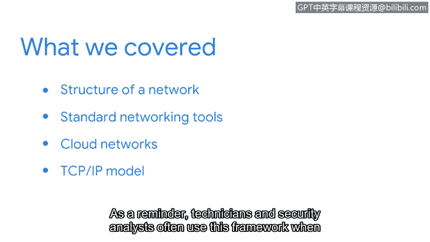

# 050：网络结构与工具总结 🎯

在本节课中，我们将总结网络结构与核心工具的关键知识。我们将回顾网络的基本构成、常用设备以及网络通信的核心模型。

## 课程概述 📚

我们探索了网络的结构，包括广域网（WAN）和局域网（LAN）。我们还讨论了标准的网络工具，例如集线器、交换机、路由器和调制解调器。我们简要介绍了云网络，并讨论了其优势。此外，我们花了一些时间讲解TCP/IP模型。需要记住的是，技术人员和安全分析师在沟通网络问题出现的位置时，经常使用这个框架。

## 网络结构与设备 🔧

上一节我们介绍了网络的基本概念，本节中我们来看看具体的网络结构与设备。

以下是网络中的关键设备及其作用：

*   **集线器（Hub）**：用于连接网络中的多个设备，但会将数据广播到所有端口。
*   **交换机（Switch）**：智能地根据MAC地址将数据转发到特定目标设备。
*   **路由器（Router）**：连接不同网络（如LAN和互联网），并根据IP地址路由数据包。
*   **调制解调器（Modem）**：在数字信号和模拟信号之间进行转换，以通过电话线或电缆进行通信。

## 云网络与TCP/IP模型 ☁️

了解了基础设备后，我们进一步探讨更现代的网络形式和通信框架。

我们简要介绍了云网络。云网络的主要优势在于其**可扩展性、成本效益和高可用性**。

我们还重点学习了TCP/IP模型。该模型是理解网络通信分层的基础。技术人员和安全分析师在定位网络问题时，常依据此模型进行沟通。其核心分层可概括为：
1.  网络接口层
2.  网际层
3.  传输层
4.  应用层

## 总结与展望 🚀

本节课中，我们一起学习了网络的基本结构、关键硬件设备、云网络的优点以及TCP/IP模型这一核心通信框架。

本节内容到此结束。接下来，你将学习更多关于网络操作以及数据如何通过无线网络传输的知识。