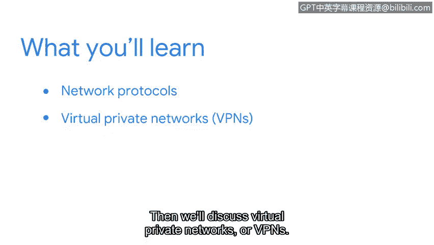

# 051：13_01_欢迎来到第二周

## 概述

在本节课程中，我们将学习网络如何通过工具和协议进行运作。这些是您作为安全分析师在日常工作中会频繁使用的核心概念。本节课程中学习的工具和协议，将帮助您保护组织的网络免受攻击。

## 网络协议与安全的重要性

您是否知道，恶意行为者可以利用网络中设备之间传输的数据？幸运的是，存在各种工具和协议来确保网络免受此类威胁。

例如，我曾仅凭攻击者使用了错误的协议就识别出了一次攻击。当时的网络流量大小正常，来源也是可信的IP地址，但因其使用了错误的协议，这足以引起我们的警觉，从而在攻击造成实际损害之前将其阻止。

## 本节学习路径

首先，我们将讨论一些常见的网络协议。接着，我们将探讨虚拟专用网络（VPN）。最后，我们将学习防火墙、安全区域和代理服务器。

现在您已经了解了本节的学习方向，让我们正式开始。

