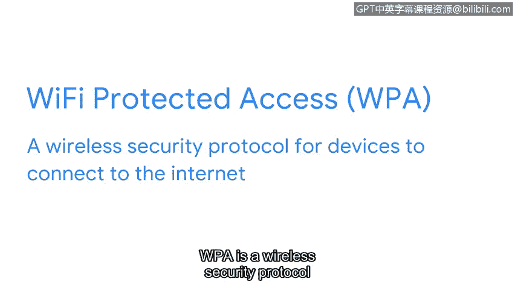

**网络安全基础：第三课：无线网络协议与安全**

在本节课中，我们将深入学习一类名为IEEE 802.11的通信协议，即我们通常所说的Wi-Fi。我们将探讨其发展历程，并重点介绍确保无线连接安全的关键协议。

---

到目前为止，我们已经学习了多种网络协议，包括像TCP/IP这样的通信协议。现在，我们将更深入地探讨一类名为IEEE 802.11的通信协议。

IEEE 802.11，通常被称为Wi-Fi，是一套定义无线局域网通信的标准。IEEE代表电气与电子工程师学会，这是一个维护Wi-Fi标准的组织。而802.11是用于无线通信的一系列协议。

Wi-Fi协议多年来不断演进，旨在变得更安全、更可靠，以提供与有线连接同等级别的安全性。在2004年，一个名为Wi-Fi保护访问的安全协议被引入。WPA是一种允许设备安全连接到互联网的无线安全协议。自那时起，WPA已发展出更新的版本，如WPA2和WPA3，它们包含了更高级的加密等进一步的安全改进。

作为安全分析师，您可能需要负责确保组织内的无线连接是安全的。

接下来，让我们了解更多关于安全措施的内容。

---

**总结**

本节课中，我们一起学习了IEEE 802.11（Wi-Fi）协议套件的基本概念及其发展。我们了解到，从最初的WPA到如今的WPA3，无线安全协议在不断演进，通过引入更强大的加密技术来保护数据传输。确保使用这些协议的最新安全版本，是维护无线网络安全的重要职责。