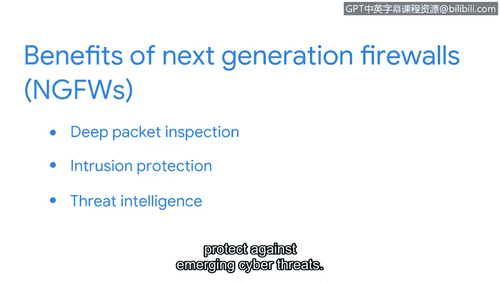

**谷歌网络安全专业证书第三课：3：防火墙与网络安全措施** 🔒

在本节课程中，我们将学习防火墙的基本概念、不同类型及其工作原理。防火墙是网络安全的基础设备，用于监控和控制网络流量。

---

防火墙是一种网络安全设备，它根据一组预定义的安全规则来监控进出网络的流量，并决定允许或阻止这些流量。

防火墙可以使用端口过滤功能，通过阻止或允许特定的端口号来限制不必要的通信。例如，可以设置一条规则，只允许用于HTTPS的端口443或用于电子邮件的端口25的通信，并阻止其他所有端口。这些防火墙设置由组织的安全策略决定。

---

接下来，我们来了解几种不同类型的防火墙。

以下是几种主要的防火墙类型：

*   **硬件防火墙**：这是防御网络威胁最基本的方式。硬件防火墙在允许每个数据包进入网络之前都会对其进行检查。
*   **软件防火墙**：其功能与硬件防火墙相同，但它不是一个物理设备，而是安装在计算机或服务器上的软件程序。安装在计算机上时，它会分析该计算机接收的所有流量；安装在服务器上时，它会保护连接到该服务器的所有设备。软件防火墙通常比购买单独的物理设备成本更低，且不占用额外空间，但作为软件程序，它会增加单个设备的处理负担。
*   **云防火墙**：云服务提供商为组织提供防火墙即服务。云防火墙是由云服务提供商托管的软件防火墙。组织可以在云服务提供商的界面上配置防火墙规则，防火墙会在所有传入流量到达组织的现场网络之前执行安全操作。云防火墙还能保护组织可能在云中使用的任何资产或流程。

---

我们讨论过的所有防火墙都可以是有状态的或无状态的。术语“有状态”和“无状态”指的是防火墙的操作方式。

*   **有状态防火墙**：这类防火墙会跟踪通过它的信息，并主动过滤掉威胁。它会分析网络流量的特征和行为，阻止可疑流量进入网络。
*   **无状态防火墙**：这类防火墙基于预定义的规则运行，不跟踪数据包中的信息。它仅根据防火墙管理员预设的规则行事，这些规则告诉设备接受什么和拒绝什么。无状态防火墙不存储或分析信息，也不会像有状态防火墙那样发现可疑趋势。因此，无状态防火墙被认为不如有状态防火墙安全。

---

上一节我们介绍了有状态防火墙，本节中我们来看看更高级的下一代防火墙。

**下一代防火墙** 提供了比有状态防火墙更多的安全性。它不仅对有状态防火墙的传入和传出流量进行状态检查，还执行更深入的安全功能，如**深度数据包检查**和**入侵防护**。一些下一代防火墙会连接到基于云的威胁情报服务，以便快速更新以防范新出现的网络威胁。

---

现在，您对防火墙及其工作原理有了基本的了解。我们学习了防火墙可以是硬件或软件形式，也讨论了无状态防火墙和有状态防火墙之间的区别，以及有状态防火墙的安全优势。最后，我们讨论了下一代防火墙及其提供的安全优势。

在本节课中，我们一起学习了防火墙作为网络安全核心组件的作用、不同类型防火墙的特点，以及有状态与无状态防火墙的关键区别。理解这些概念是构建有效网络防御体系的基础。