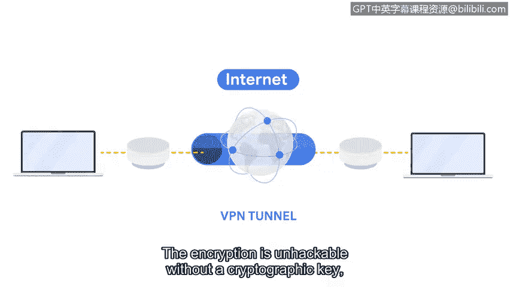

# 056：虚拟专用网络（VPN）

在本节课中，我们将学习虚拟专用网络（VPN）如何为您的网络增加安全性。VPN是一种重要的网络安全服务，它通过加密和隐藏您的网络活动来保护您的隐私和数据安全。

当您连接到互联网时，您的互联网服务提供商会接收您网络的请求，并将其转发到正确的目标服务器。但您的互联网请求包含了您的私人信息。这意味着如果网络流量被截获，有人可能将您的互联网活动与您的物理位置和个人信息关联起来。这些信息包括您希望保密的银行账户和信用卡号等。

## 什么是VPN？🔒

虚拟专用网络（VPN）是一种网络安全服务，它能改变您的公共IP地址并隐藏您的虚拟位置，从而在使用公共网络（如互联网）时保护您的数据隐私。VPN还会在您的数据穿越互联网时对其进行加密，以保障机密性。

## VPN如何工作？🛡️

VPN服务对传输中的数据进行封装。封装是VPN服务执行的一个过程，通过将敏感数据包裹在其他数据包中来保护您的数据。

上一节我们介绍了数据包的结构，您了解到目标设备的MAC地址和IP地址包含在数据包的头部和尾部。这是一个安全威胁，因为它暴露了您私有网络的IP地址和虚拟位置。

您可以通过加密数据包来确保您的信息不被破译，但这样一来，网络路由器将无法读取IP和MAC地址，从而不知道将数据包发送到哪里。这意味着您将无法连接到您想要的互联网站点或服务。

封装解决了这个问题，同时仍能保护您的隐私。

以下是VPN封装数据的基本过程：

1.  VPN服务加密您的原始数据包。
2.  将加密后的数据包封装在一个新的、路由器可读的外层数据包中。
3.  这个外层数据包包含VPN服务器的地址信息，而非您的真实地址。
4.  数据包通过互联网传输到VPN服务器。
5.  VPN服务器解封装外层数据包，解密原始数据，并将其转发到最终目的地。

这个过程允许您的网络请求到达其目的地，同时仍对您的个人数据进行加密，使其在传输过程中不可读。

## VPN加密隧道🔐

VPN还会在您的设备和VPN服务器之间建立一个加密隧道。没有加密密钥，这种加密是无法被破解的，因此没有人能够访问您的数据。

VPN服务操作简单，并能提供显著的保护。使用VPN时，您可以额外确信您的数据已被加密。您的IP地址和虚拟位置对恶意行为者来说是不可读的。

## 总结

本节课中，我们一起学习了虚拟专用网络（VPN）的核心概念和工作原理。我们了解到VPN通过**封装**和**加密**技术，在公共网络上创建一个安全的私有通道，从而隐藏用户的真实IP地址和位置，保护数据传输的机密性。VPN是维护个人和组织网络安全与隐私的重要工具。