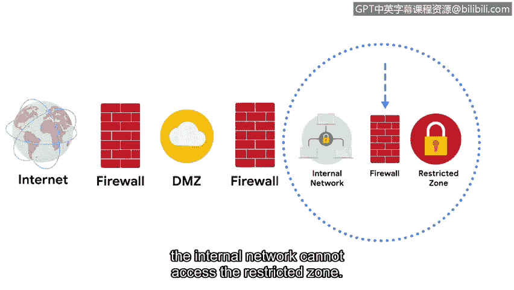

**谷歌网络安全专业证书第三课：连接与保护：网络与网络安全：P57：安全区域**

在本节中，我们将讨论一种称为安全区域的网络安全特性。

安全区域是网络的一个分段，用于保护内部网络免受互联网的威胁。它是称为网络分段的安全技术的一部分。网络分段将网络划分为多个部分。

每个网络段都有其自己的访问权限和安全规则。安全区域控制谁可以访问网络的不同部分。安全区域充当内部网络的屏障，维护公司团体内部的隐私，并防止问题扩散到整个网络。

网络分段的一个例子是提供免费公共Wi-Fi的酒店。不安全的访客网络与酒店员工使用的另一个加密网络是分开的。

此外，组织的网络可以划分为子网，以维护每个部门和组织的隐私。例如，在大学里，可能有一个教职员工子网和一个单独的学生子网。如果学生子网受到污染，网络管理员可以将其隔离，并保持网络的其余部分不受污染。

组织的网络被分为两种类型的安全区域。首先，是非受控区域，这是组织控制之外的任何网络，如互联网。然后是受控区域，这是一个保护内部网络免受非受控区域影响的子网。

在受控区域内，有几种类型的网络。最外层是隔离区，也称为DMZ。DMZ包含可以访问互联网的面向公众的服务。这包括为公众托管网站的Web服务器、代理服务器以及为互联网用户提供IP地址的DNS服务器。它还包括处理外部通信的电子邮件和文件服务器。

DMZ充当内部网络的网络边界。内部网络包含组织需要保护的私有服务器和数据。在内部网络内部是另一个称为限制区域的区域。限制区域保护高度机密的信息，只有具有特定权限的员工才能访问。

现在，让我们尝试描绘这些安全区域。理想情况下，DMZ位于两个防火墙之间。其中一个过滤DMZ外部的流量，另一个过滤进入内部网络的流量。这通过多层防御保护了内部网络。如果存在限制区域，它也将受到另一个防火墙的保护。这样，渗透到DMZ网络的攻击无法扩散到内部网络，而渗透到内部网络的攻击也无法访问限制区域。

作为安全分析师，您可能负责管理这些防火墙上的访问控制策略。安全团队可以通过限制IP地址和端口来控制到达DMZ和内部网络的流量。例如，分析师可以确保只允许HTTPS流量访问DMZ中的Web服务器。

安全区域是保护网络安全的重要组成部分，尤其是在大型组织中。理解它们的使用方式对所有安全分析师都至关重要。接下来，我们将学习如何保护内部网络。