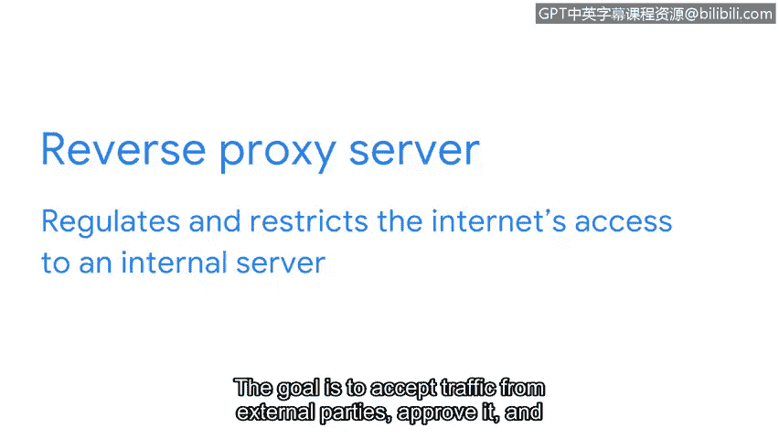

**谷歌网络安全专业证书第三课：连接与保护：网络与网络安全：P58：代理服务器**

**概述**

在本节中，我们将学习代理服务器如何作为一项关键系统来帮助保护网络。我们将了解代理服务器的定义、工作原理、不同类型及其在现实世界中的应用。

**代理服务器简介**

上一节我们讨论了防火墙、VPN和安全区域如何帮助保护网络。本节中，我们来看看如何使用代理服务器来保护内部网络。

代理服务器是另一个有助于保护网络的系统。其定义是：通过将客户端的请求转发给其他服务器来满足客户端请求的服务器。

代理服务器是一台专用服务器，位于互联网和网络其余部分之间。当从互联网传来连接网络的请求时，代理服务器将判断该连接请求是否安全。代理服务器使用一个与私有网络其余部分不同的公共IP地址。这向互联网上的恶意行为者隐藏了私有网络的IP地址，从而增加了一层安全性。

**代理服务器的工作原理**

让我们通过一个例子来研究其工作原理。当客户端收到响应时，他们会注意到一个被扭曲的IP地址或根本没有IP地址，而不是组织网络服务器的真实IP地址。

代理服务器还可用于阻止用户访问组织网络上不允许访问的不安全网站。代理服务器使用临时内存来存储外部服务器经常请求的数据。这样，它就不必每次都从组织的内部服务器获取数据。通过减少与内部服务器的接触，这增强了安全性。

**代理服务器的类型**

有多种类型的代理服务器支持网络安全。对于监控来自各种代理服务器的流量并可能需要了解其用途的安全分析师来说，这一点很重要。

以下是几种不同类型的代理服务器：

*   **正向代理服务器**：用于监管和限制个人对互联网的访问。其目标是隐藏用户的IP地址并批准所有传出请求。在组织环境中，正向代理服务器接收来自员工的传出流量，批准后将其转发到互联网上的目的地。
*   **反向代理服务器**：用于监管和限制互联网对内部服务器的访问。其目标是接收来自外部方的流量，批准后将其转发到内部服务器。这种设置有助于保护包含机密数据的内部网络服务器，避免其IP地址暴露给外部方。
*   **电子邮件代理服务器**：这是另一个有价值的安全工具。它通过验证发件人地址是否被伪造来过滤垃圾邮件。这降低了冒充组织内部人员的网络钓鱼攻击风险。

**现实世界示例**

让我们谈谈电子邮件代理的一个真实例子。几年前，当我在美国一家大型宽带互联网服务提供商工作时，我们使用代理服务器在允许邮件投递前实施多层反垃圾邮件过滤。最终，它标记了大约95%的邮件为垃圾邮件。代理服务器使我们能够进行过滤，并扩展这些过滤器，而不会影响底层的电子邮件平台。

**总结**

在本节中，我们一起学习了代理服务器。它们通过过滤传入和传出的流量，并对网络攻击保持警惕，在网络安全中扮演着重要角色。这些设备为我们称之为互联网的不安全公共网络增加了一层保护。