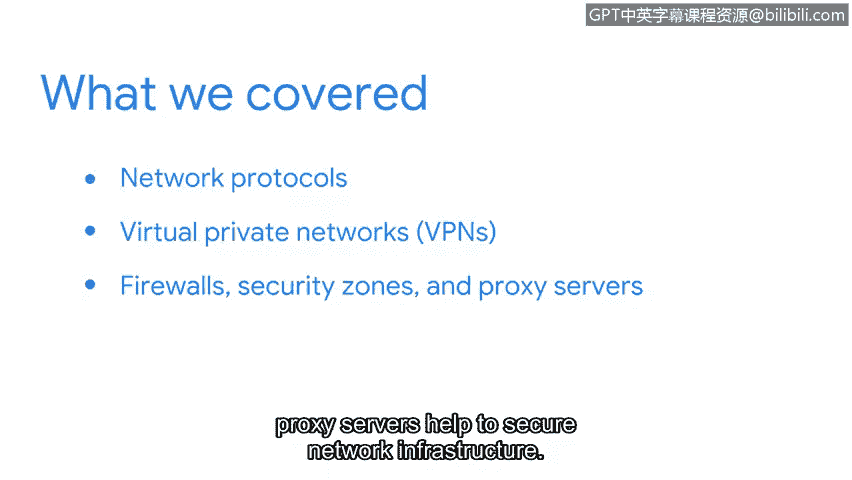

# 059：章节总结

在本节课中，我们将回顾并总结本部分所涵盖的核心网络与网络安全概念。我们已经探讨了网络协议、隐私保护技术以及基础设施安全工具。

## 章节回顾 🧩

上一节我们介绍了网络通信的基础，本节中我们来看看本部分内容的总结。

首先，我们讨论了常见的网络协议。

以下是本部分涵盖的关键协议：
*   **TCP**：传输控制协议，确保数据可靠传输。
*   **ARP**：地址解析协议，将IP地址映射到物理MAC地址。
*   **HTTPS**：超文本传输安全协议，用于安全的网页通信。
*   **DNS**：域名系统，将域名解析为IP地址。

接着，我们探讨了如何在公共网络中维护隐私。

以下是本部分介绍的核心隐私技术：
*   **VPN**：虚拟专用网络，通过在公共网络上创建加密隧道来保护数据传输的隐私。

最后，我们研究了如何保护网络基础设施本身。

以下是本部分涉及的主要安全工具与概念：
*   **防火墙**：监控和控制网络流量的安全系统。
*   **安全区**：将网络划分为不同信任级别的区域。
*   **代理服务器**：作为客户端和服务器之间的中介，可以过滤请求、提供缓存并增强安全。

## 核心总结 📋

总而言之，网络运维是一个涉及多种工具、协议和技术的广阔领域，这些要素共同保障网络平稳且安全地运行。

你可以随时返回复习这些视频内容，这些知识对于任何类型的安全分析师角色都至关重要。

本节课中我们一起学习了关键网络协议、VPN隐私保护技术以及防火墙等基础设施安全组件，这些都是构建安全网络环境的基础。