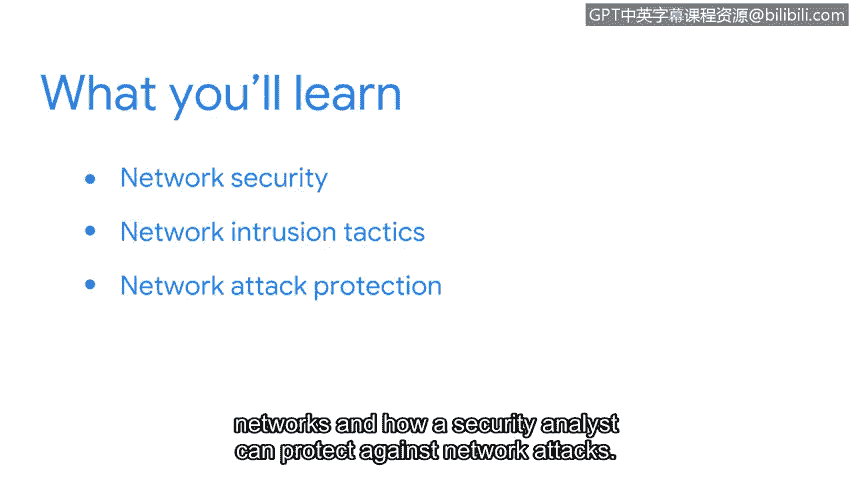

# 060：22_01_welcome-to-week-3

## 概述
在本节课中，我们将学习如何保护网络免受攻击。你已经对网络和网络安全有了相当程度的理解。现在，你将学习如何保护网络，确保其中包含的宝贵信息不会落入错误的人手中。

我们将讨论网络入侵策略如何对网络构成威胁，以及安全分析师如何防范网络攻击。

让我们开始吧。😊

## 网络入侵的威胁
上一节我们概述了课程目标，本节中我们来看看网络入侵的具体威胁。网络攻击者使用各种策略来破坏网络的安全。

以下是几种常见的网络入侵战术：
*   **端口扫描**：攻击者探测网络设备上开放的端口，以发现潜在的攻击入口。
*   **数据包嗅探**：攻击者捕获在网络中传输的数据包，以窃取敏感信息。
*   **暴力破解**：攻击者通过系统性地尝试所有可能的组合来破解密码或加密密钥。其基本形式可表示为：`尝试次数 ∝ (字符集大小)^(密码长度)`。
*   **数据包注入**：攻击者将恶意数据包插入到正常的数据流中，以破坏通信或执行恶意代码。

## 安全防护措施
了解了威胁之后，我们需要学习如何防御。安全分析师通过实施一系列控制措施来保护网络。

以下是关键的网络安全防护措施：
*   **防火墙**：作为网络边界的安全屏障，根据预定义规则过滤进出网络的数据流量。核心规则通常基于：`允许/拒绝 [协议] 从 [源IP] 到 [目标IP] 的 [端口] 流量`。
*   **入侵检测与防御系统（IDS/IPS）**：监控网络流量，识别可疑模式（IDS），并可主动阻止潜在攻击（IPS）。
*   **虚拟专用网络（VPN）**：通过加密隧道在公共网络上创建安全的连接，保护数据传输。常用协议包括IPsec和OpenVPN。
*   **访问控制列表（ACL）**：定义哪些用户或系统有权访问特定网络资源的规则列表。

## 总结
本节课中，我们一起学习了网络攻击的常见入侵战术，并探讨了安全分析师用于保护网络的关键防护措施。理解这些攻击与防御的基本原理，是构建安全网络环境、保护信息资产的重要基础。

