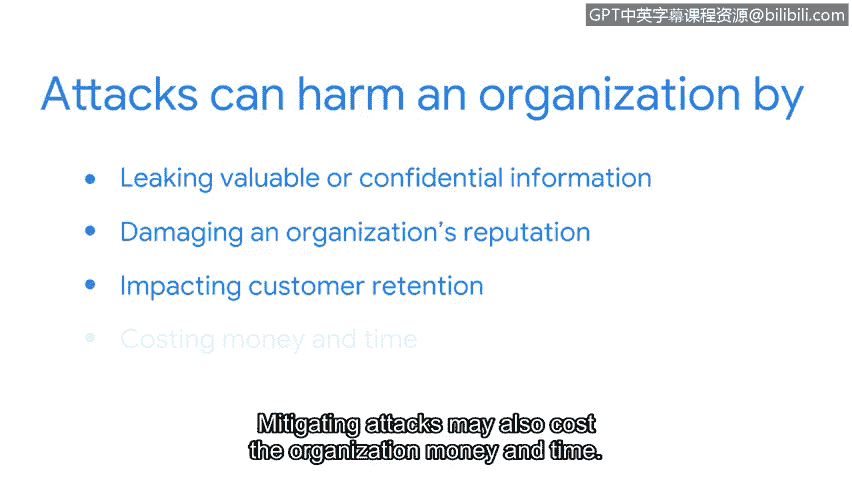

# 061：23_02_保障网络安全的必要性

在本节课程中，我们将探讨为什么需要保障网络安全。我们将了解网络面临的主要风险，并通过一个真实案例来理解网络攻击可能造成的严重后果。

首先，我们来回答这个问题：为什么我们需要安全的网络？正如你已经学到的，网络始终面临着来自恶意行为者的攻击风险。

攻击者可以通过多种方式渗透网络，例如**恶意软件**、**欺骗**或**数据包嗅探**。网络运营也可能因**数据包泛洪**等攻击而中断。随着课程的深入，你将更详细地了解这些以及其他常见的网络入侵攻击。

保护网络免受此类攻击至关重要。即使其中任何一种攻击发生，都可能对组织造成灾难性影响。攻击可能通过泄露有价值或机密信息来损害组织。它们也可能损害组织的声誉并影响客户留存。缓解攻击还可能耗费组织大量的金钱和时间。

过去几年，有许多例子可以说明网络攻击可能造成的损害。一个臭名昭著的例子是2014年针对美国家居建材连锁商家得宝的攻击。

一群黑客入侵并感染了家得宝的服务器。当网络管理员最终阻止攻击时，黑客已经窃取了超过5600万客户的信用卡和借记卡信息。

现在，你知道了保障网络安全为何如此重要。但要维护网络安全，你需要知道需要防范哪些类型的攻击。

在接下来的内容中，你将学习一些常见的网络攻击。

本节课中，我们一起学习了保障网络安全的根本原因。我们了解到网络面临多种攻击风险，这些攻击可能导致数据泄露、声誉损害和财务损失。通过家得宝的案例，我们看到了现实世界中网络攻击的严重性。理解这些风险是构建有效防御策略的第一步。