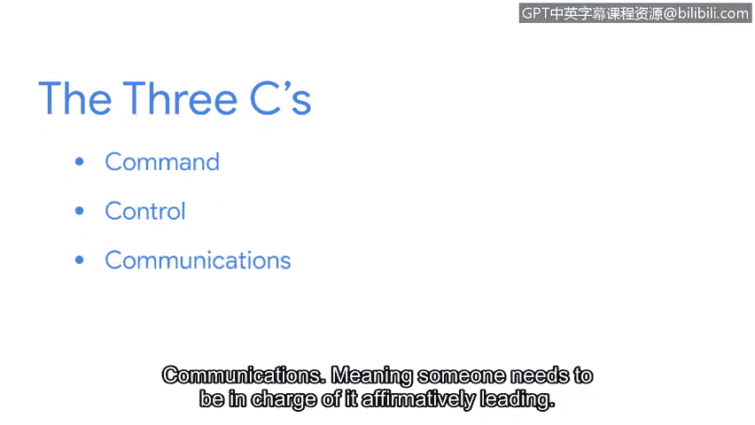

# 062：Matt - 应对攻击的专业人士分享

在本节课程中，我们将跟随谷歌的混乱专家Matt，了解他如何从一名救生员转型为网络安全事件响应专家，并学习应对网络攻击的核心原则与心态。我们将探讨攻击的类型、事件响应中的关键要素，以及进入网络安全领域的建议。

## 从救生员到网络安全专家：Matt的职业旅程

我的名字是Matt，我是谷歌的一名混乱专家。公司允许我们选择最能描述自己工作的职位头衔。

我花费大量时间规划如何应对任何可能出错的事情。当问题真正发生时，我的职责是组建团队并尽快修复它。

我最初完全没有进入技术行业的打算。高中时，我首先在公共泳池，后来在州立海滩担任救生员。

救生工作让我真正爱上了救援。因此我考取了急救医疗技术员执照，并完成了消防员学校的培训。

大约在我大学进程过半，并且每天从事消防员工作的时候，我正经历一些职业倦怠和压力。我需要改变生活。

一位从早期文本网络游戏时代就和我一起在线游戏的朋友对我说：我能看出你筋疲力尽，需要改变。我和朋友们要去旧金山创业，你愿意一起来吗？

我回答：你意识到我不是搞电脑的吧？他说：不，你就是搞电脑的，只是你不承认。

吸引我进入技术领域事件响应的，与最初吸引我进入医疗救援的是同一种东西。我真的很喜欢在人们最糟糕的一天陪伴他们。

在人们真正需要你、不知该向何处求助时出现，这一直是我内心渴望满足的部分。我很幸运在数字取证和事件响应领域找到了同样的乐趣。

## 谷歌面临的网络攻击类型

谷歌面临过哪些类型的攻击？这是一个很难回答的问题。

因为我们面临着大多数其他公司面临的所有类型的攻击：追求勒索软件的人、窃取工业机密的人、其他国家寻找情报信息的行为。

不久前发生了一次非常有趣的攻击。攻击者对从技术公司获取大量关于软件漏洞的信息感兴趣。

他们实施了一项长期活动，在社交媒体上塑造看似合法的安全研究员人设。

然后接触我们领域的其他安全研究员，建立关系，并在恰当时机悄悄植入一些恶意软件。

## 应对攻击：压力与心态

遭到已经取得一些进展的对手攻击，压力巨大。你最初的想法和感受会带有一点恐慌。

“哦，不，这将是很糟糕的一天。我要为此工作多久？他们做了什么？我该怎么办？”

对我而言，我反复对自己念的 mantra 是：作为一名事件响应者，我是来提供帮助的。

## 成功事件响应的关键：三个C原则

在事件中获得良好结果最重要的因素，我们称之为 **三个C原则**：指挥、控制和沟通。

这意味着需要有人负责，积极领导。需要有人对所有参与者进行控制，以确保每个人目标一致，专注于任务。

其中最大且最重要的是：**恰当的沟通**。

如果你有对事件处理有帮助的建议，不要直接去做。先与某人沟通。“我认为我可以做这个来帮助我们取得进展。”“我认为如果我们查看这里，会发现更多数据。”

## 给网络安全新人的建议

我想给那些想进入网络安全领域的人的建议是：如果你想要进入这个领域，你可能就属于这里。

我们在这个领域需要更多充满热情、好奇心、善于提问的人，那些想知道更多、想建设得更好、并且关心为必须使用技术的人们创造更安全环境的人。

这些正是我们行业需要的人，我希望你加入进来。😊

---

**本节总结**

本节课中，我们一起学习了Matt从救援行业到网络安全领域的独特职业路径。我们了解了谷歌面临的各种网络攻击，包括高级持续性威胁。重点掌握了在高压下进行事件响应时的心态调整方法，以及确保响应成功的**三个C核心原则**：指挥、控制与沟通。最后，我们获得了对于有志于进入网络安全领域新人的鼓励与清晰建议：热情、好奇心和改善安全的意愿是比技术背景更重要的入门钥匙。