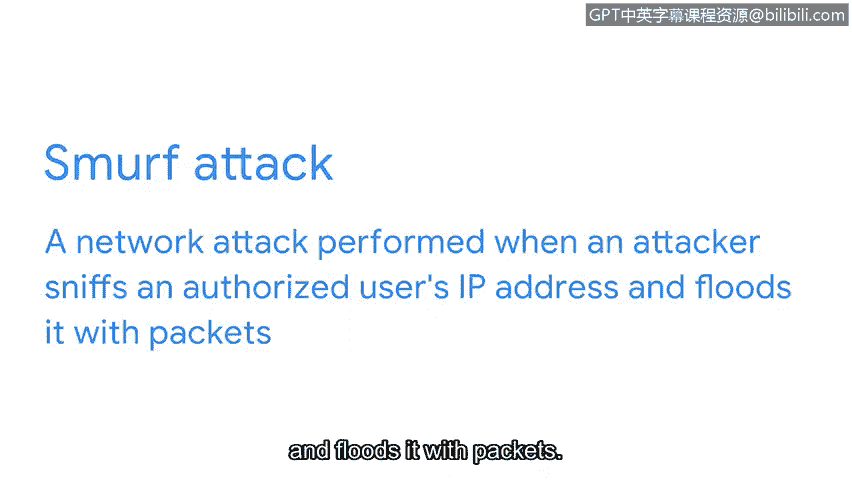

# 065：IP欺骗攻击与防护


在本节课中，我们将要学习一种名为IP欺骗的网络攻击。我们将了解IP欺骗的定义、几种常见的攻击类型，以及如何配置防火墙来保护网络免受此类攻击。

## IP欺骗概述

上一节我们介绍了网络攻击的基本概念，本节中我们来看看一种具体的攻击手法——IP欺骗。

IP欺骗是一种网络攻击，攻击者通过更改数据包的源IP地址，来冒充一个授权系统，从而获取网络访问权限。在这种攻击中，黑客伪装成他人，以便通过网络与目标计算机通信，并绕过可能阻止外部流量的防火墙规则。

## 常见的IP欺骗攻击类型

以下是三种常见的IP欺骗攻击：

*   **中间人攻击**：在这种攻击中，恶意行为者将自己置于一个已授权的连接中间，拦截或篡改传输中的数据。中间人攻击者先获取网络访问权限，然后将自己置于两个设备（如网络浏览器和网络服务器）之间。接着，他们嗅探数据包信息，以获取正在通信的两个设备的IP地址和MAC地址。获得这些信息后，他们就可以伪装成其中任何一个设备。
*   **重放攻击**：这是一种网络攻击，恶意行为者拦截传输中的数据包，并将其延迟或在另一个时间重复发送。一个被延迟的数据包可能导致目标计算机之间的连接问题。或者，攻击者可能截获授权用户发送的网络传输，并在稍后时间重复发送，以冒充该授权用户。
*   **Smurf攻击**：这是分布式拒绝服务攻击与IP欺骗攻击的结合。攻击者嗅探授权用户的IP地址，并用大量数据包淹没该地址。这会使目标计算机不堪重负，并可能导致服务器或整个网络瘫痪。

## 如何防护IP欺骗攻击



现在你已经了解了不同类型的IP欺骗攻击，让我们来谈谈如何保护网络免受此类攻击。

正如之前所学，应始终实施加密，以确保网络传输中的数据不会被恶意行为者读取。防火墙可以配置以防止IP欺骗。

IP欺骗通过将数据包的发送方地址更改为与目标网络地址相匹配，使恶意行为者看起来像是授权用户。因此，如果防火墙从互联网接收到一个数据包，其发送方IP地址与私有网络相同，那么防火墙将拒绝该传输。因为所有具有该IP地址的设备本应已在本地网络上。

你可以通过创建一条规则来确保防火墙配置正确，该规则拒绝所有与本地网络IP地址相同的传入流量。核心配置思路可以用以下伪代码表示：

```
if (incoming_packet.source_ip == local_network_ip_range) {
    deny_packet();
}
```


本节课中我们一起学习了IP欺骗攻击。我们了解了IP欺骗如何被用于中间人攻击、重放攻击和Smurf攻击等常见攻击中，并掌握了通过配置防火墙规则来有效防御此类攻击的基本方法。