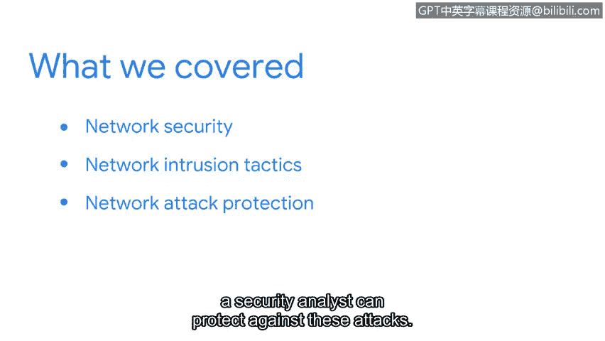

# 066：章节回顾与总结

在本节课中，我们将回顾并总结关于网络攻击与防护的核心知识。我们已经探讨了如何保护网络，学习了多种网络入侵手段，并了解了安全分析师如何防御这些攻击。

## 📚 本节内容回顾

上一节我们介绍了网络攻击的基本概念，本节中我们来总结已学到的具体攻击类型与防护思路。

以下是我们在本节中讨论过的网络入侵策略：

*   **恶意数据包嗅探**：攻击者通过捕获流经网络的数据包来窃取敏感信息。
*   **IP欺骗**：攻击者伪造其数据包的源IP地址，以隐藏身份或冒充受信任的系统。

## 🛡️ 拒绝服务攻击

我们学习了多种旨在通过洪泛网络使其不堪重负的拒绝服务攻击。

以下是几种常见的DoS与DDoS攻击类型：

*   **ICMP洪泛攻击**：向目标发送大量ICMP回显请求数据包，消耗其带宽与资源。
*   **SYN洪水攻击**：利用TCP三次握手过程，发送大量SYN请求但不完成握手，耗尽目标连接资源。
*   **死亡之Ping**：发送超大的或畸形的ICMP数据包，导致目标系统崩溃或重启。

## 🎯 知识应用与展望

你已经掌握了关于网络攻击的诸多知识。这些视频中所学内容对于你未来作为一名安全分析师的工作至关重要。

接下来，你将学习安全分析师如何运用各种**安全强化技术**来保护网络。例如，通过配置防火墙规则、更新系统补丁和部署入侵检测系统来增强网络防御。

## 📝 总结

本节课中我们一起学习了网络安全的防御视角，包括恶意数据包嗅探、IP欺骗等网络入侵手段，以及ICMP洪泛、SYN攻击和死亡之Ping等拒绝服务攻击的原理。这些知识是构建有效网络防御体系的基础。