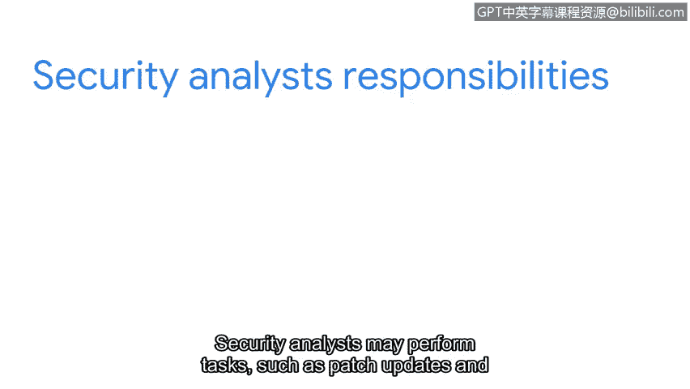

# 067：29_01_welcome-to-week-4

## 概述

在本节课中，我们将要学习**安全加固**。安全加固是网络安全领域的一项核心实践，旨在通过一系列措施来增强系统、网络和应用程序的安全性，减少潜在的攻击面。

首先，我想祝贺你到目前为止取得的进展。你首先学习了网络运维。接着，你学习了帮助网络系统运行的工具和协议。然后，你了解了网络中的漏洞以及这些漏洞如何使系统面临各种安全入侵。

现在，我们将讨论安全加固。我们将学习操作系统加固，探索网络加固实践，并讨论云环境下的加固实践。安全加固可以在设备、网络、应用程序和云基础设施中实施。作为安全分析师，执行补丁更新和备份等任务将是安全加固工作的一部分。

## 安全加固简介

上一节我们回顾了之前的学习路径，本节中我们来看看什么是安全加固。安全加固是一个系统性的过程，目的是通过减少漏洞和配置弱点来提升IT资产的安全性。

安全分析师在日常工作中，安全加固将扮演重要角色。理解其工作原理对你至关重要。

以下是安全加固的主要实施层面：

*   **设备加固**：强化单个硬件设备（如服务器、工作站、路由器）的安全配置。
*   **网络加固**：保护网络基础设施，例如防火墙规则优化、网络分段。
*   **应用程序加固**：确保软件应用在开发和部署阶段的安全性。
*   **云基础设施加固**：在云服务环境中应用安全策略和配置。

## 安全加固的核心任务

了解了安全加固的范围后，我们来看看安全分析师具体需要执行哪些任务。这些任务是安全加固日常工作的核心组成部分。

以下是安全分析师在加固过程中可能执行的关键任务：

*   **补丁管理**：定期应用安全补丁和更新，以修复已知漏洞。公式可以表示为：`系统安全状态 = 初始状态 + ∑(应用的安全补丁)`
*   **系统备份**：执行定期数据备份，确保在发生安全事件时能够快速恢复。一个简单的备份策略代码描述可能是：`if (备份周期到达): 执行全量/增量备份()`
*   **配置管理**：检查和强化系统与服务的配置设置，例如禁用不必要的服务、实施强密码策略。
*   **访问控制**：实施最小权限原则，确保用户和程序只拥有其完成任务所必需的权限。

随着课程的深入，我们将详细讨论这些任务。

## 总结

本节课中我们一起学习了安全加固的基本概念。我们了解到安全加固是一个涉及设备、网络、应用和云的多层面过程。作为未来安全分析师的核心职责，你需要掌握补丁更新、备份、配置强化等关键任务，以有效提升组织的整体安全态势。

我对能陪伴你继续这段学习旅程感到高兴。我们下一个视频再见。

