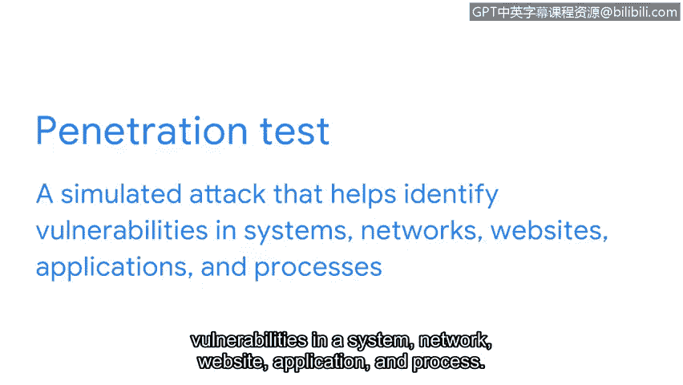

**网络安全专业证书：第三课：连接与保护：网络与网络安全**

**P68：安全加固**

在本节中，我们将学习**安全加固**的概念。安全分析师及其所在组织必须主动保护系统免受攻击，安全加固正是实现这一目标的关键过程。

---

### **概述：什么是安全加固？** 🛡️

安全分析师及其所在组织必须主动保护系统免受攻击。安全加固就是实现这一目标的关键过程。

**安全加固**是指通过一系列措施来强化系统，以减少其**漏洞**和**攻击面**的过程。所有可能被威胁行为者利用的潜在漏洞，统称为系统的**攻击面**。

我们可以用一个比喻来理解：将网络比作一所房子。那么，攻击面就相当于所有窃贼可能用来进入这所房子的门和窗户。

---

### **安全加固的目标与方法** 🎯

正如给房子的所有门窗上锁一样，安全加固的目标是**最小化攻击面**或潜在漏洞，使网络尽可能安全。

作为安全加固的一部分，安全分析师会执行定期的维护程序，以确保网络设备和系统安全、最优地运行。安全加固可以在任何可能被入侵的设备或系统上进行，例如：

*   **硬件**
*   **操作系统**
*   **应用程序**
*   **计算机网络**
*   **数据库**

物理安全也是安全加固的一部分，例如使用安全摄像头和安保人员来保护物理空间。

---

### **常见的加固程序** 🔧

以下是几种常见的安全加固程序类型：

*   **软件更新**：也称为**补丁**，用于修复已知的安全漏洞。
*   **设备或应用程序配置更改**：这些更新和更改旨在增强安全性并修复网络上的安全漏洞。

例如，一个安全配置更改可以是要求使用更长的密码或更频繁地更改密码。这增加了恶意行为者获取登录凭证的难度。

另一个配置检查的示例是更新数据库中存储数据的加密标准。保持加密技术最新，使得恶意行为者更难访问数据库。

---

### **减少攻击面的策略** 📉

其他安全加固的示例包括：

*   移除或禁用未使用的应用程序和服务。
*   禁用未使用的端口。
*   减少跨设备和网络的访问权限。

通过最小化应用程序、设备、端口和访问权限的数量，可以使网络和设备监控更加高效，并**减少整体攻击面**。这是保护组织安全的最佳方法之一。

---

### **渗透测试：主动发现漏洞** 🔍

安全加固的另一个重要策略是定期进行**渗透测试**。

**渗透测试**，也称为**渗透测试**，是一种模拟攻击，旨在帮助识别系统、网络、网站、应用程序和流程中的漏洞。

渗透测试人员将他们的发现记录在报告中。根据测试失败的位置，安全团队可以确定需要修复的安全漏洞类型。组织随后可以审查这些漏洞并制定修复计划。

---

### **总结** ✅

在本节中，我们一起学习了安全加固作为保护网络的一个基本方面。它是网络安全的基石，通过强化网络来减少成功攻击的数量。接下来，你将进一步了解安全加固如何在实际中应用。