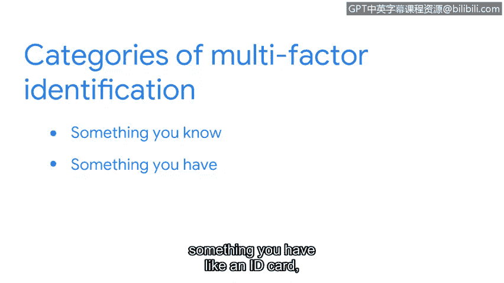

# 069：操作系统加固实践 🔒

在本节课中，我们将学习操作系统加固的概念及其重要性，并了解一系列用于保护操作系统安全的核心实践。

操作系统是计算机硬件与用户之间的接口。它是计算机启动时加载的第一个程序，充当软件应用程序与计算机硬件之间的中介。确保每个系统中的操作系统安全至关重要，因为一个不安全的操作系统可能导致整个网络被攻陷。存在多种类型的操作系统，它们都遵循相似的安全加固实践。

接下来，我们将探讨一些推荐用于保护操作系统的安全加固实践。其中一些任务需要定期执行，而另一些则作为初步安全措施只需执行一次。

## 定期执行的加固任务 🔄

上一节我们介绍了操作系统加固的基本概念，本节中我们来看看那些需要定期执行的任务，例如补丁安装。

**补丁安装**，也称为补丁更新，是一种软件和操作系统更新，旨在解决程序或产品中的安全漏洞。这些补丁通常由操作系统软件供应商提供给公司。通过补丁更新，操作系统应升级到其最新的软件版本。有时，补丁的发布是为了修复软件中的安全漏洞。

一旦操作系统供应商发布补丁和漏洞修复程序，恶意行为者就会确切知道运行过时操作系统的系统中漏洞所在的位置。这就是为什么组织在补丁发布后立即运行更新非常重要。例如，我的团队曾不得不执行紧急补丁，以解决在一个常用编程库中发现的最新漏洞。该库几乎无处不在，因此我们必须快速为大多数服务器和应用程序打补丁以修复该漏洞。

新更新的操作系统应添加到**基线配置**中，也称为基线镜像。基线配置是系统内一组有文档记录的规范，用作未来构建、发布和更新的基础。例如，一个基线可能包含一个带有允许和禁止网络端口列表的防火墙规则。如果安全团队怀疑有影响操作系统的异常活动，他们可以将当前配置与基线进行比较，以确保没有任何更改。

以下是其他需要定期执行的加固任务：
*   **硬件和软件处置**：确保所有旧硬件被正确擦除和处置。同时，删除任何未使用的软件应用程序也是一个好主意，因为一些流行的编程语言存在已知漏洞。移除未使用的软件可以确保没有与软件使用的程序相关的不必要漏洞。
*   **实施强密码策略**：强密码策略要求密码遵循特定规则。例如，组织可能设置一个要求至少8个字符、一个大写字母、一个数字和一个符号的密码策略。为了阻止恶意行为者，密码策略通常规定，用户连续输入错误密码达到一定次数后将失去网络访问权限。一些系统还要求**多因素认证**。MFA是一种安全措施，要求用户通过两种或更多方式验证其身份才能访问系统或网络。验证身份的方式包括：你知道的东西（如密码）、你拥有的东西（如身份证）或你独有的特征（如指纹）。

## 总结与展望 📝

本节课中我们一起学习了操作系统加固，这是一套维护并提升操作系统安全性的程序。像访问权限和密码策略这样的安全措施，作为操作系统加固的一部分，需要频繁进行定期安全检查。

接下来，我们将讨论网络加固实践。