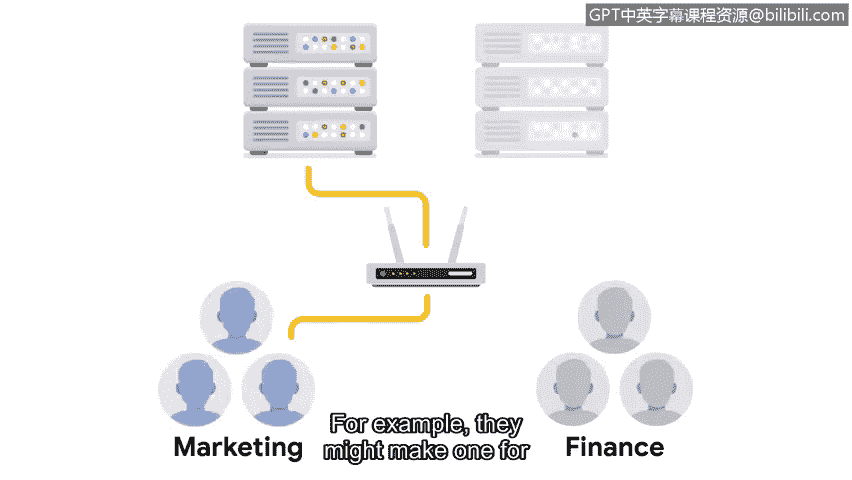

# 070：网络加固实践

在本节课程中，我们将学习网络加固的核心概念与实践方法。网络加固旨在通过一系列安全措施来强化网络本身，以抵御潜在威胁。我们将了解需要定期执行的任务和一次性配置的任务，并掌握如何运用这些知识来保护组织网络。

## 🔒 网络加固概述

之前，我们学习了操作系统加固，它侧重于设备安全，并运用补丁更新、安全配置和账户访问策略。

本节我们将聚焦于网络加固。网络加固侧重于与网络相关的安全强化措施，例如端口过滤、网络访问权限和网络加密。

某些网络加固任务需要定期执行，而另一些任务则只需配置一次，之后根据需要更新。

## 📅 定期执行的网络加固任务

以下是需要安全团队定期执行的一些关键任务：

*   **防火墙规则维护**：定期审查和更新防火墙规则，确保其符合当前的安全策略和业务需求。
*   **网络日志分析**：网络日志分析是检查网络日志以识别感兴趣事件的过程。安全团队使用日志分析工具或安全信息与事件管理工具（SIEM）来进行分析。SIEM工具是一种收集和分析日志数据以监控组织关键活动的应用程序。它从网络收集安全数据，并在一个仪表板上呈现这些数据，这个界面有时被称为“单一管理平台”。SIEM帮助分析师根据优先级检查、分析网络中的安全事件并做出响应。SIEM生成的报告会列出新的或持续存在的网络漏洞，并按优先级从高到低进行排序，其中高优先级漏洞的修复期限要短得多。
*   **补丁更新**：为网络设备（如路由器、交换机、防火墙）及时安装安全补丁。
*   **服务器备份**：定期备份关键服务器数据，确保在发生安全事件或系统故障时能够恢复。

## ⚙️ 一次性配置的网络加固任务

上一节我们介绍了需要定期维护的任务，本节中我们来看看那些通常只需配置一次，后续进行更新的网络加固措施。

这些任务包括防火墙上的端口过滤、网络访问权限和通信加密等。

让我们从端口过滤开始。端口过滤可以在网络层面进行。**端口过滤**是防火墙的一项功能，它通过阻止或允许特定的端口号来限制不必要的通信。一个基本原则是：只允许需要的端口，任何正常网络操作不使用的端口都应被禁止。这有助于防范端口漏洞。

网络应配置为使用最新的可用无线协议，并禁用旧的无线协议。

安全分析师还使用**网络分段**为组织中的不同部门创建隔离的子网。例如，他们可能为市场部创建一个子网，为财务部创建另一个子网。

这样做是为了确保每个子网中的问题不会蔓延到整个公司，并且只有指定的用户才能访问其角色所需的那部分网络。网络分段也可用于分隔不同的安全区域。网络中任何包含高度机密或敏感数据的限制区域应与网络的其他部分隔离。

最后，所有网络通信都应使用最新的加密标准进行加密。**加密标准**是用于隐藏传出数据和揭示（或解密）传入数据的规则或方法。限制区域中的数据应采用更高的加密标准，这使得它们更难被访问。

## 🎯 总结

本节课中我们一起学习了最常见的网络加固实践。你了解了定期任务（如日志分析和补丁管理）与一次性配置任务（如端口过滤、网络分段和加密）的区别。这些知识对于你完成证书课程至关重要，也是你未来作为安全分析师职业生涯的基石。

