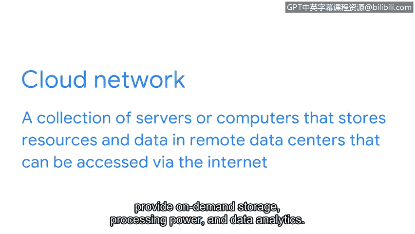

# 071：云中的网络安全 🔒

在本节课程中，我们将学习云环境下的网络安全。随着越来越多的组织使用云服务，安全分析师不仅需要保护本地网络，还必须掌握保护云网络的知识与技能。

---

近年来，许多组织开始使用云端的网络服务。

因此，除了保护本地网络，安全分析师还需要保护云网络。

在之前的视频中，你了解到**云网络**是一个服务器或计算机的集合，它将资源和数据存储在远程数据中心，可以通过互联网访问。

它们可以利用**云计算**来托管公司数据和应用程序，提供按需存储、处理能力和数据分析。

---

就像普通的网络服务器一样，云服务器也需要通过各种安全加固程序进行适当的维护。

虽然云服务器由云服务提供商托管，但这些提供商无法完全防止云中的入侵，尤其是来自组织内部或外部的恶意行为者的入侵。

云网络加固与传统网络加固的一个区别在于，云中存储的所有服务器实例都使用一个**服务器基准镜像**。

这允许你将云服务器中的数据与基准镜像进行比较，以确保没有发生任何未经核实的更改。

未经核实的更改可能源于云网络中的入侵。

---

类似于操作系统加固，云网络上的数据和应用程序会根据其服务类别进行隔离。

例如，旧版应用程序应与新版应用程序分开存放。

处理内部功能的软件应与用户可见的前端应用程序分开存放。

---

尽管云服务提供商与使用其服务的组织负有共同责任，但组织仍需采取安全措施以确保其云网络的安全。

就像传统网络一样，云中的操作也需要被保护。

---

**总结**

本节课中，我们一起学习了云网络安全的基本概念。我们了解到云网络同样需要像传统网络一样进行安全加固和维护，包括使用基准镜像进行监控、对不同的服务和应用程序进行逻辑隔离，并明确了组织在云安全中的自身责任。掌握这些知识是保护现代混合IT环境安全的重要一步。