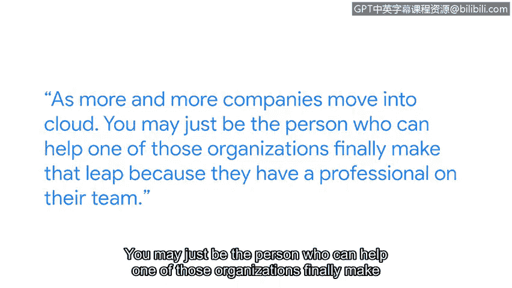

# 072：云安全入门指南

在本节课程中，我们将跟随谷歌云的杰出工程师Kelsey，了解云安全的基本概念、从零开始进入科技行业的路径，以及如何通过实践来掌握云安全技能。课程将解释私有云与公共云的区别，并为初学者提供实用的学习建议。

## 个人职业旅程 🚀

我是Kelsey，是谷歌云的一名杰出工程师。我的工作主要涉及计算平台和安全相关主题。

在我职业生涯起步时，我唯一有把握能找到的工作是快餐店的工作。但我渴望的是一份事业，而不仅仅是一份工作。因此，当我退一步思考自己的职业选择时，我认为在1999年，没有比进入科技世界更好的地方了。那时，新闻里人们排队购买最新的操作系统，科技从业者成为了新的摇滚明星。我记得翻阅分类广告中的职位空缺，上面写着：**“任何拥有这些认证的人，请告诉我们，因为我们正在招聘。”**

对我而言，从开始学习到获得我梦寐以求的第一份工作，其间的差距只是一本价值35美元的认证书籍。

## 理解云计算 ☁️

上一节我们介绍了进入科技行业的个人动机，本节中我们来看看云计算的核心概念。

让我们谈谈云。在云计算出现之前，大多数公司都拥有自己的数据中心。可以想象成你独自一人住在房子里。你可以把任何东西放在任何地方，甚至可能选择从不锁门，因为里面只有你自己。在很长一段时间里，我们的行业就是这样运行数据中心的。现在我们称之为**私有云**，即只有你自己。

而公共云则不同。用一个类比来说，想象一下你开始有了室友。这时，你会开始以不同的方式看待你的物品，即使在家里你也会开始锁东西，你的安全习惯也会变得截然不同。

随着越来越多的公司迁移到云端，你可能正是那个能帮助某个组织最终实现这一飞跃的人，因为他们团队中拥有了一位专业人士。

## 掌握与实践技能 🛠️

我们已经了解了云计算模型，接下来探讨如何将所学知识应用于实践。

好的，你已经获得了认证，掌握了基本技能。如何确保你能够在云中实际运用它们呢？我要告诉你一个小秘密：**去使用云**。

以下是开始实践的具体步骤：
1.  获取现有的软件。
2.  将其部署到云环境中。
3.  利用各种工具对你刚刚运行起来的东西进行探测和测试。

这个过程会告诉你系统的薄弱环节在哪里。学习使用这些工具至关重要，因为专业人士使用的正是这些工具。

学习是一种超能力。它不仅能让你获得心仪的工作，还能赋予你定义下一份职业机会的能力。

## 课程总结 📝

本节课中我们一起学习了Kelsey从入门到成为谷歌云工程师的历程，理解了私有云与公共云的核心区别，并掌握了通过动手实践来学习和巩固云安全技能的关键方法。记住，积极实践和持续学习是你在网络安全领域建立职业生涯的基石。