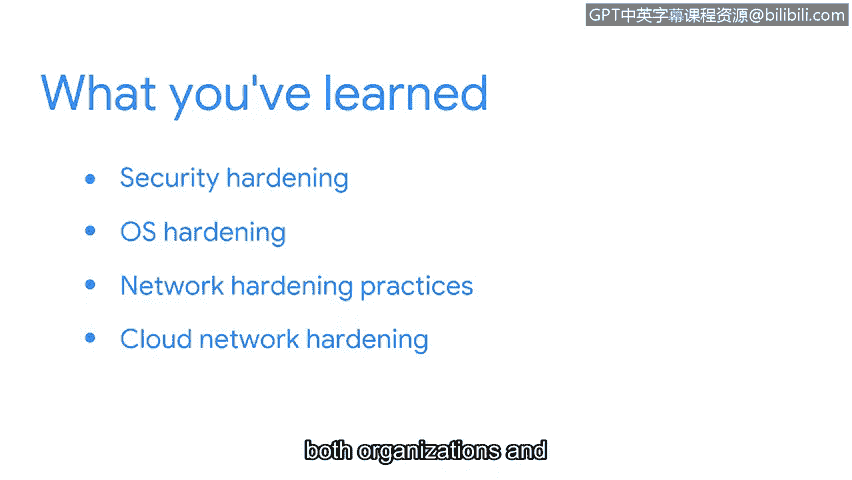

# 073：课程总结

在本节课中，我们将回顾并总结关于“安全加固”的核心知识。安全加固是保护组织基础设施免受攻击的关键实践。

## 概述

安全加固对于保护组织的基础设施至关重要。它涉及一系列旨在强化系统与网络、降低攻击可能性的措施。接下来，我们将回顾本课程中探讨的几个主要方面。

## 安全加固及其重要性

首先，我们讨论了安全加固如何强化系统和网络以降低遭受攻击的可能性。其核心目标是减少潜在的攻击面，增强整体防御能力。

## 操作系统加固

上一节我们介绍了安全加固的整体概念，本节中我们来看看操作系统加固的具体实践。操作系统加固是安全基础的重要组成部分。

以下是操作系统加固的几个关键实践：
*   **补丁更新**：及时安装安全补丁以修复已知漏洞。
*   **基线配置**：按照安全标准（如 `CIS Benchmarks`）配置系统，确保一致的初始安全状态。
*   **硬件与软件处置**：安全地淘汰旧硬件和软件，防止数据泄露。

## 网络加固实践

在了解了如何保护单个系统后，我们将视角扩展到整个网络。网络加固实践有助于监控和防御网络层面的威胁。

以下是两项重要的网络加固实践：
*   **网络日志分析**：定期审查网络设备（如路由器、防火墙）生成的日志，以发现异常活动。例如，使用 `grep` 命令筛选可疑的登录尝试：`grep "Failed password" /var/log/auth.log`。
*   **防火墙规则维护**：持续评估和更新防火墙规则，确保只允许必要的网络流量。规则可以表述为：**允许 IP_A 访问 端口_B** 或 **拒绝 所有 访问 端口_C**。

## 云网络加固

最后，我们探讨了云环境下的网络加固。云安全遵循责任共担模型，需要组织和云服务提供商共同努力。

在云网络加固中，双方的责任通常划分如下：
*   **云服务提供商责任**：保护云基础设施本身的安全（即“云的安全”）。
*   **组织责任**：保护在云中部署的内容的安全（即“云内安全”），包括配置虚拟网络、安全组和访问控制。

## 总结

本节课中我们一起学习了安全加固的完整框架。你了解了安全加固对组织的重要性，并掌握了操作系统加固、网络加固以及云网络加固的核心实践。作为一名安全分析师，你将在职业生涯中运用这些知识来保护本地网络和云网络中的操作系统。