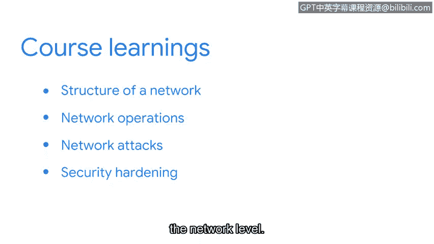

# 074：网络与网络安全 👨‍💻

## 概述

在本节课中，我们将回顾并总结整个课程的核心内容。我们探讨了网络的结构、运作方式以及安全专业人员用于保护网络免受安全威胁的最佳实践。这些知识是网络安全分析师履行职责的基础。

---

## 课程回顾

上一节我们介绍了网络安全的多个方面，本节中我们来系统地回顾所有关键知识点。

### 网络结构与架构

首先，我们探讨了网络的结构。网络安全分析师必须理解网络的设计方式，才能识别网络中存在的漏洞以及接下来需要加固的部分。网络架构决定了设备如何连接和通信。

### 网络运作与数据通信

接着，我们学习了网络运作及其如何影响数据的通信。**网络协议**决定了数据如何在网络中传输。常见的协议包括TCP/IP。

### 网络威胁与攻击

在通信过程中，恶意行为者可能使用多种攻击手段。以下是几种常见的网络攻击类型：
*   **拒绝服务攻击**：通过洪水般的请求使目标系统瘫痪。
*   **数据包嗅探**：截获并分析网络中传输的数据。
*   **IP欺骗**：伪造源IP地址以隐藏攻击者身份或冒充可信系统。

### 防御工具与措施

为了抵御这些攻击，安全分析师会使用各种工具和措施。例如，通过配置**防火墙规则**来控制进出网络的流量，从而建立一道安全屏障。

### 安全加固

我们还讨论了安全加固。**安全加固**用于减少网络的受攻击面。这意味着攻击无法使整个网络瘫痪。安全加固可以在多个层面进行：
*   **硬件层面**：如更新固件、禁用不必要的物理端口。
*   **软件层面**：如及时安装补丁、移除冗余服务。
*   **网络层面**：如实施网络分段、使用虚拟专用网络。

---

## 总结与展望

本节课中，我们一起学习了网络安全的基础。保护网络是安全分析师职责的核心部分。对网络及其运作和安全实践的了解，将确保你在网络安全分析师的职业生涯中取得成功。

这自然将我们引向下一个课程的主题。在接下来的课程中，我们将涵盖安全分析师所需的计算基础。你将学习如何使用Linux命令行来认证和授权网络用户，并使用**SQL**（结构化查询语言）与数据库进行通信。

你已经完成了本课程的学习，非常棒！在本节中学到的所有概念，对于你未来成功扮演安全分析师的角色都至关重要。现在，你可以继续学习下一门课程了。祝你学习愉快！