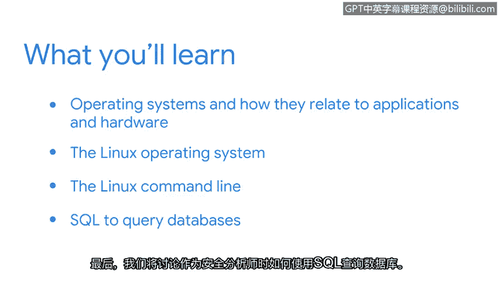

# 001：课程介绍

## 概述
在本节课中，我们将要学习《工具之道：Linux与SQL》这门课程的核心内容与目标。课程将介绍操作系统、Linux命令行以及SQL查询的基础知识，并解释这些技能如何应用于网络安全分析师的日常工作中。

## 课程内容与目标
大家好，欢迎来到这门关于安全领域计算基础的课程。我叫Kim，是一名安全领域的技术项目经理。我伴随着计算机和互联网成长，但直到看到安全如何与技术交织在一起，才真正将其视为一个职业机会。

在我从事第一份安全工作之前，我在一个云应用团队工作，需要定期与安全团队互动。那是我第一次接触安全工作，但保护信息并与他人共同实现这一目标的想法让我感到兴奋。因此，我决定努力考取CISSP认证，这为我在公司带来了新的工作机会，并使我得以转入安全领域。

至此，如果你一直跟随学习，你已经探索了安全领域中各种有用的概念，包括安全域和网络。我很高兴能在课程的下一部分加入你们，我们将放慢节奏，以便你能以实际的方式理解这些主题。

本课程的重点是计算基础。当你理解一个组织系统中机器的工作原理时，它能帮助你更高效地完成作为安全分析师的工作。作为安全分析师，你的部分工作是保护系统免受可能的攻击。你是保护组织数据的第一道防线之一。为了有效地做到这一点，了解你所保护的系统如何运作是有帮助的。

此外，你可能需要调查事件以帮助纠正系统中的错误。熟悉Linux操作系统及其相关命令，并能够通过SQL与组织的数据进行交互，将有助于你完成这些任务。

在本课程中，你将学习操作系统及其与应用程序和硬件的关系。接下来，你将更详细地探索Linux操作系统。然后，你将在安全背景下使用Linux命令行。最后，我们将讨论作为安全分析师工作时，如何使用SQL查询数据库。

我很高兴能与你们一起探索所有这些主题。让我们开始吧。

## 总结
本节课中我们一起学习了《工具之道：Linux与SQL》课程的总体介绍。我们了解了课程的目标是掌握操作系统基础、Linux命令行操作以及SQL数据库查询，并认识到这些技能对于有效执行网络安全分析、保护系统与调查事件至关重要。