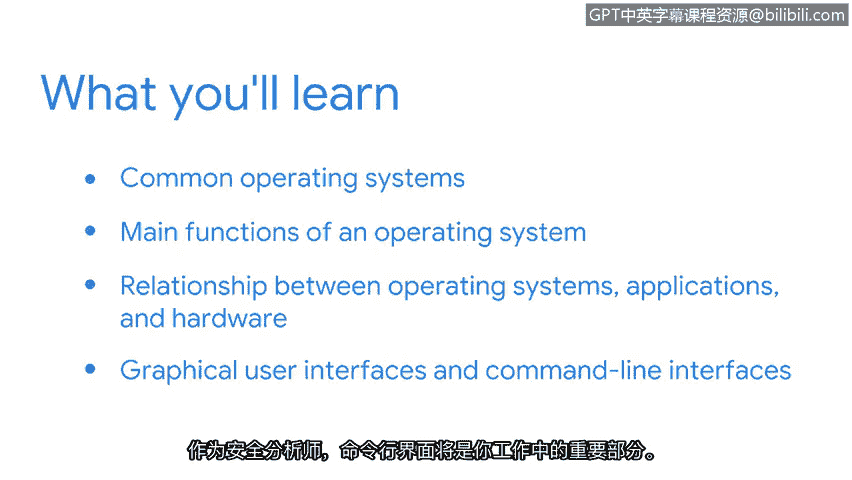

# 002：操作系统基础

在本节课中，我们将要学习操作系统的基础知识。操作系统是计算机的核心软件，它管理硬件资源并为应用程序提供运行环境。理解操作系统是网络安全分析工作的重要基石。

## 什么是操作系统？

你每周使用计算机多少次？对一些人来说，答案可能是“非常多”。计算机是功能强大的机器，它让我们能够完成各种任务，从工作中使用专业应用程序，到向远方的亲人发送电子邮件。

你是否想过计算机如何做到这一切？答案就在于操作系统。在本节中，我们将了解常见的操作系统，并探索操作系统的主要功能。

## 操作系统的主要功能

上一节我们引入了操作系统的概念，本节中我们来看看它的核心作用。操作系统是管理计算机硬件与软件资源的系统软件。它充当用户与计算机硬件之间的桥梁。

以下是操作系统执行的几个关键功能：
*   **资源管理**：管理中央处理器、内存、磁盘空间和输入/输出设备。
*   **进程管理**：启动、运行和结束应用程序（进程）。
*   **内存管理**：分配和回收内存空间供程序使用。
*   **文件系统管理**：组织、存储、检索和保护文件和目录。
*   **用户界面**：提供用户与计算机交互的方式，例如图形界面或命令行。

## 操作系统、应用程序与硬件的关系

理解了操作系统的功能后，我们进一步探讨它与计算机其他部分的关系。操作系统、应用程序和硬件共同协作，完成用户的任务。

它们的关系可以概括为：**用户**通过**应用程序**发出指令，**应用程序**调用**操作系统**的服务，**操作系统**直接管理和控制**硬件**资源。例如，当你在文字处理软件中保存文档时，应用程序会请求操作系统将数据写入硬盘，操作系统则负责执行具体的磁盘写入操作。

## 图形用户界面与命令行界面

操作系统提供了不同的方式供用户与之交互。最常见的两种是图形用户界面和命令行界面。

*   **图形用户界面**：用户通过视觉元素如图标、窗口和菜单，使用鼠标和键盘进行操作。这种方式直观易用。
*   **命令行界面**：用户通过输入特定的文本命令来执行操作。这种方式高效、灵活，并且可以编写脚本实现自动化。

对于安全分析师而言，**命令行界面**是工作的必备部分。它允许分析师快速执行诊断、监控系统状态、分析日志文件以及运行安全工具。

## 总结

本节课中我们一起学习了操作系统的基础知识。我们了解了操作系统的定义及其核心功能，探讨了操作系统、应用程序和硬件三者之间的关系，并比较了图形用户界面与命令行界面的特点。掌握这些知识，特别是熟悉命令行界面的使用，将为你后续的网络安全分析学习打下坚实的基础。接下来，我们将深入探索命令行环境。