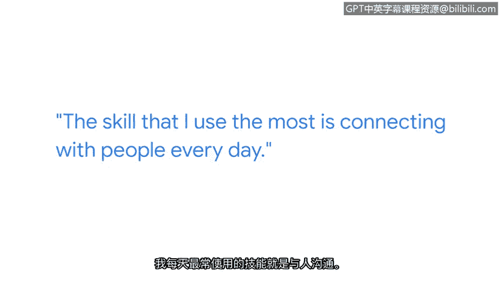

# 003：金姆的计算机领域学习之旅

## 概述
在本节课中，我们将跟随谷歌技术项目经理金姆，了解她从非技术背景起步，最终进入网络安全领域的职业旅程。她的故事将展示，无论起点如何，对技术的热情和持续学习都能引领你走向网络安全职业。

## 金姆的职业起点
金姆目前在谷歌的安全并购团队担任技术项目经理。她的工作是与谷歌收购的其他公司合作，帮助它们整合到谷歌的环境中。

在进入网络安全乃至整个技术领域之前，金姆曾担任过多种角色。她的职业生涯始于餐厅服务员。

## 转向教育与技术领域
随后，她在当地大学成为国际学生的英语导师。在完成了多次实习并从大学毕业之后，她获得了第一个进入技术领域工作的机会。正是从这里开始，她对技术以及最终对网络安全的兴趣被点燃了。

## 给初学者的鼓励与建议
金姆想告诉所有背景的人：如果你对保护信息感兴趣，如果你对保护人们感兴趣，网络安全领域欢迎你。未来，安全领域会有你的位置。你可以从事许多不同的职位，并且你现在拥有的以及之前积累的所有技能，都能在安全领域中得到应用。

### 最重要的技能
以下是金姆认为工作中最重要的技能：
*   **与人沟通**：这是她最依赖的核心技能。她每天使用最多的技能就是与人建立联系。除非她以正确的方式与他人沟通，否则她无法完成任何工作。

### 给新人的建议
对于刚进入网络安全领域的新人，金姆的一条建议是保持开放的心态。她本人是从商科学位起步的，起初甚至觉得自己不够技术，无法达到今天的成就。在那之前，她所有的经验要么是餐厅工作，要么是市场营销，或者是一些感觉与技术无关的工作。

但所有这些经历都帮助并激励她更多地涉足技术领域，并最终进入安全领域。在她意识到之前，那种自我怀疑已经被同事们的支持和共事者的尊重所取代。

## 总结
本节课中，我们一起学习了金姆从非技术背景成功转型为谷歌网络安全专业人士的经历。她的故事强调了**保持开放心态**和**有效沟通**的重要性，并证明多样化的背景和经验是进入网络安全领域的宝贵财富，而非障碍。无论你的起点在哪里，对保护信息与人的热情和持续学习是通往这个领域的关键。