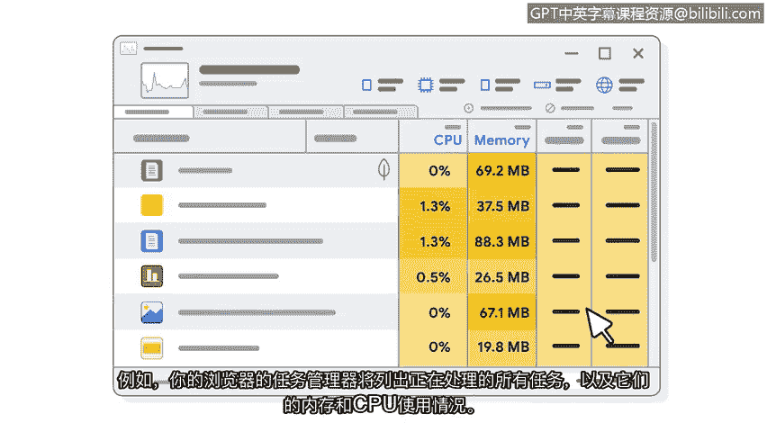

# 006：操作系统资源分配

## 概述
在本节课中，我们将要学习操作系统如何管理计算机的资源。我们将探讨操作系统如何像指挥家一样，协调CPU、内存和存储等资源，确保系统高效运行。这对于理解后续的安全技能至关重要。

---

## 操作系统作为资源管理者

上一节我们介绍了操作系统与其他计算机部件的交互。本节中我们来看看操作系统如何管理系统资源。

操作系统不仅与其他计算机部件交互，还负责管理系统的资源。这是一项需要大量平衡工作的重大任务，以确保计算机的所有资源都被有效利用。

可以将此概念类比为能量。一个人需要能量来完成不同的任务。有些任务需要更多能量，而另一些则需要较少。例如，跑步比看电视需要更多能量。

计算机的操作系统也需要确保它有足够的能量来正确执行特定任务。在计算机上运行杀毒扫描比使用计算器应用程序会消耗更多能量。

---

## 操作系统：计算机的指挥家

想象你的计算机是一个管弦乐队。许多不同的乐器，如小提琴、鼓和小号，都是乐队的一部分。乐队还有一位指挥来引导音乐的流向。

在计算机中，操作系统就是指挥家。操作系统处理资源和内存管理，以确保计算机系统有限的能力被用在最需要的地方。

各种程序、任务和进程不断竞争中央处理器（CPU）的资源。它们都有各自需要内存、存储和输入/输出带宽的理由。

操作系统负责确保每个程序都在分配和释放资源。所有这些都在你的计算机中同时发生，以使你的系统高效运行。

作为用户，这些过程大部分对你来说是隐藏的。例如，你的浏览器任务管理器会列出所有正在处理的任务及其内存和CPU使用情况。

---

## 资源管理对安全分析的重要性

以下是了解资源管理对安全分析师至关重要的原因：

*   **识别资源使用情况**：了解系统资源的使用位置有助于分析师响应事件和排查系统中的应用程序问题。
*   **发现异常**：例如，如果一台计算机运行缓慢，分析师可能会发现其正在将资源分配给恶意软件。
*   **奠定安全基础**：对操作系统工作原理的基本理解将帮助你更好地理解本课程后续将学到的安全技能。

---

## 总结
本节课中我们一起学习了操作系统作为资源管理者的核心角色。我们了解到操作系统如何像指挥家一样，协调和分配CPU、内存等关键资源，确保多个程序能高效、稳定地运行。理解这一机制是诊断系统性能问题、识别恶意活动（如资源被恶意软件占用）的重要基础，为我们后续深入学习网络安全技能做好了准备。