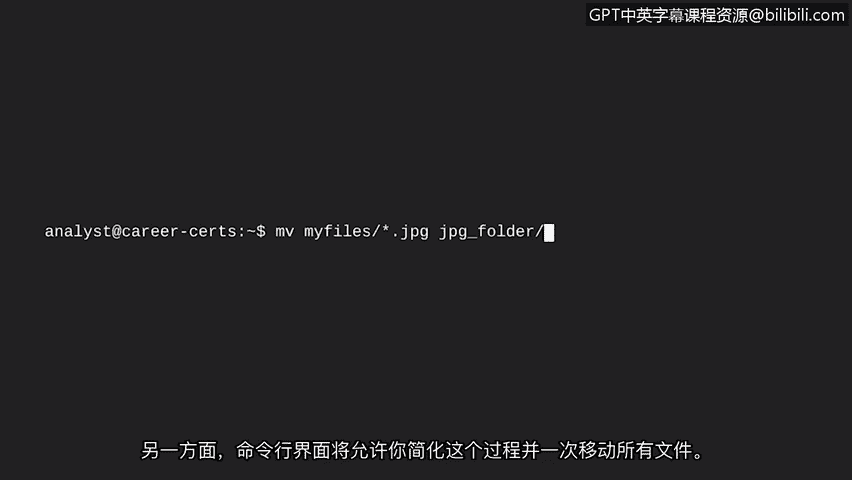

# 007：图形用户界面（GUI）与命令行界面（CLI）

## 概述
在本节课中，我们将要学习用户与操作系统进行通信的两种主要方式：图形用户界面（GUI）和命令行界面（CLI）。我们将了解它们各自的特点、工作原理以及在实际工作中的应用场景。

## 用户与操作系统的通信
上一节我们介绍了计算机的内部工作原理。本节中，我们来看看用户如何与操作系统进行交互以向硬件发送任务。

用户通过一个**接口**与操作系统进行通信。用户界面是一种允许用户控制操作系统功能的程序。我们将讨论的两种用户界面是图形用户界面（GUI）和命令行界面（CLI）。

## 图形用户界面（GUI）
图形用户界面（GUI）是一种利用屏幕上的图标来管理计算机上不同任务的用户界面。大多数操作系统都可以使用图形用户界面。

如果你使用过个人电脑或手机，那么你就有操作图形用户界面的经验。

以下是图形用户界面通常包含的组件：
*   **开始菜单与程序组**：用于组织和启动应用程序。
*   **任务栏**：用于快速启动程序。
*   **桌面**：包含图标和快捷方式。

所有这些组件都帮助你与操作系统通信以执行任务。

除了点击图标，在使用图形用户界面时，你还可以从开始菜单搜索文件或应用程序。你只需要记住程序的图标或名称即可启动应用。

## 命令行界面（CLI）
现在，让我们来讨论命令行界面。

相比之下，命令行界面（CLI）是一种基于文本的用户界面，它使用命令与计算机进行交互。这些命令与操作系统通信并执行诸如打开程序等任务。

命令行界面的结构与图形用户界面有很大不同。当你使用命令行界面时，会立刻注意到区别：屏幕上没有图标或图形。命令行界面看起来类似于使用特定文本语言的代码行。

命令行界面比图形用户界面更灵活、更强大。可以这样理解：使用命令行界面就像在杂货店的食材区自己搭配想吃的任何饭菜，这让你对要吃什么有很大的控制权和定制能力。相比之下，使用图形用户界面更像是从餐厅点餐，你只能点菜单上有的东西。如果你既想吃面条又想吃披萨，但你去的第一家餐厅只有披萨，你就得去另一家餐厅点面条。

使用图形用户界面，你必须一次完成一项任务，但命令行界面允许定制，这让你可以同时完成多项任务。例如，想象你有一个包含数百个不同类型文件的文件夹，你需要仅将JPEG文件移动到一个新文件夹中。想想使用图形用户界面在这个文件夹中找到每个JPEG文件并将其移动到新文件夹中是多么缓慢和繁琐。另一方面，命令行界面则可以让你简化这个过程，一次性移动所有文件。

## 两种界面的比较与安全分析中的应用
正如你所见，这两种用户界面存在非常大的差异。

作为一名安全分析师，你的部分工作可能涉及使用命令行界面来分析日志或进行用户身份验证与授权。安全分析师在日常工作中普遍使用命令行界面。

## 总结
本节课中，我们一起学习了两种类型的用户界面。你了解到自己已经拥有使用图形用户界面的经验，因为大多数个人电脑和手机都使用图形用户界面。同时，你也初步认识了命令行界面。在本课程后续部分，你将学习如何在Linux中使用命令行界面，以及它对你作为安全分析师的日常工作有多么重要。你将获得通过命令行进行通信的实践经验。