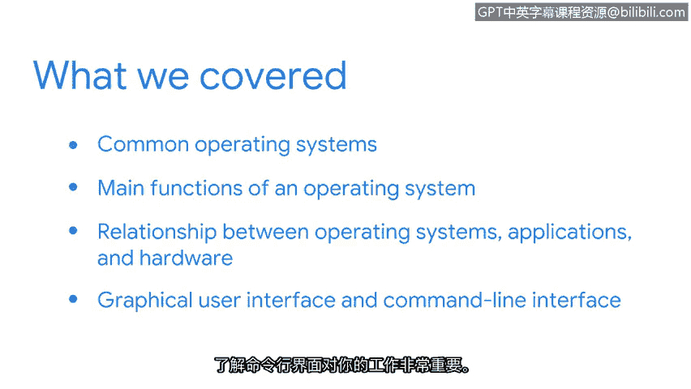

# 009：8_总结

## 概述

在本节课中，我们将回顾并总结前面章节所学习的关键知识。主要内容包括操作系统的基础知识、其核心功能，以及图形用户界面与命令行界面的区别。这些知识对于网络安全分析师至关重要。

## 课程内容回顾

我们共同完成了一段重要的学习旅程。最棒的是，我们一同探讨了一些非常实用的主题。

现在，让我们来回顾本节课程的核心要点。

作为一名安全分析师，理解你所使用的系统至关重要。掌握计算机基础知识将帮助你更有效、更高效地完成工作。

在本节中，我们介绍了常见的操作系统，并讨论了操作系统的主要功能。重要的是，你学习了**操作系统、应用程序和硬件之间的关系**。了解它们如何像管弦乐队一样协同工作，是非常有益的。

此外，你还学习了**图形用户界面**与**命令行界面**之间的区别。理解命令行界面对你的工作将非常重要。

## 总结与展望

很高兴能与你一同探索操作系统的世界。了解操作系统的工作原理，是迈向安全分析师职位的重要一步。你做得非常出色。

让我们继续推进这个课程项目。在下一节中，我们将专门聚焦于 **Linux 操作系统**。