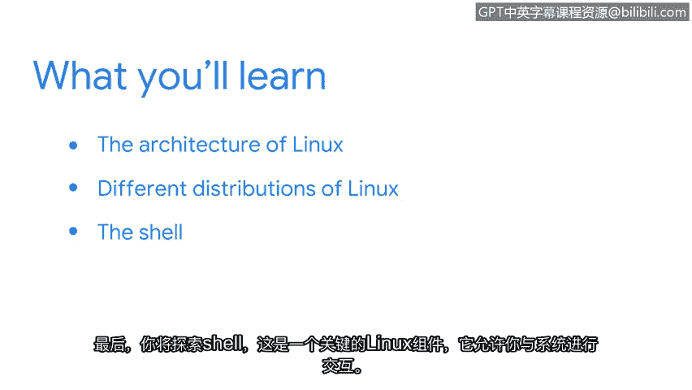

# 010：Linux与SQL


## 概述
在本节课中，我们将要学习Linux操作系统的基础知识。我们将了解Linux的架构、不同的发行版本，以及如何通过Shell与系统进行交互。这些知识对于网络安全领域的日常工作至关重要。

---

## 第四课：第2周：欢迎来到第二周

上一节我们介绍了操作系统和用户界面的基本概念，学习了操作系统的工作原理以及计算机资源的分配方式。我们还回顾了几种常见的操作系统。你可能已经有了自己偏爱的操作系统。

在安全领域，Linux被广泛使用。本节中，我们将深入学习Linux操作系统及其在日常任务和安全工作中的应用。

首先，我们将学习Linux的架构。

### Linux的架构
Linux操作系统遵循一种分层的架构模型。其核心是**内核**，它负责管理系统的硬件资源，如CPU、内存和输入/输出设备。内核之上是**系统库**和**Shell**，它们为用户和应用程序提供了与内核交互的接口。最外层是**应用程序**，用户通过它们执行具体任务。

其架构可以简化为以下层次：
*   **硬件层**
*   **内核层**
*   **系统库/Shell层**
*   **应用程序层**

接下来，我们将比较Linux的不同发行版本。

### Linux的发行版本
Linux有众多不同的发行版本，它们都基于相同的Linux内核，但打包了不同的软件、包管理器和用户界面。以下是几种常见的发行版：

*   **Ubuntu**：用户友好，适合初学者，拥有庞大的社区支持。
*   **Fedora**：以集成最新技术而闻名，通常用于开发和前沿应用。
*   **Debian**：以稳定性和庞大的软件仓库著称，是许多发行版（包括Ubuntu）的基础。
*   **CentOS/RHEL**：广泛应用于企业服务器环境，强调稳定性和长期支持。

最后，我们来探索一个关键的Linux组件：Shell。

### Linux Shell
Shell是一个命令行解释器，它充当用户与Linux内核之间的桥梁。用户通过输入文本命令来与Shell交互，Shell则解释这些命令并指示内核执行相应的操作。



例如，要列出当前目录下的文件和文件夹，可以使用 `ls` 命令：
```bash
ls
```
要创建一个新目录，可以使用 `mkdir` 命令：
```bash
mkdir new_folder
```

---


## 总结
本节课中我们一起学习了Linux操作系统的基础知识。我们探讨了Linux的分层架构，比较了几种主流的Linux发行版，并介绍了通过Shell与系统进行命令行交互的基本方式。掌握这些内容是进一步学习Linux系统管理和网络安全技能的重要第一步。