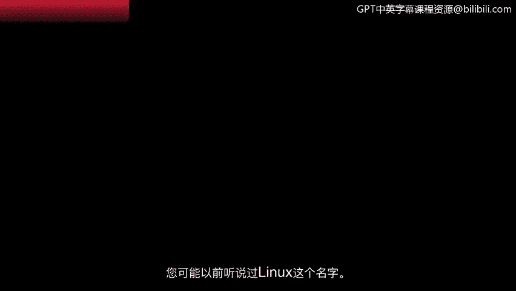

**谷歌网络安全专业证书第四课：4：Linux简介**

在本节课中，我们将要学习Linux操作系统的基本概念、其独特之处，以及它在网络安全领域中的核心应用。

---

您可能在过去见过或听说过Linux这个名字。但您是否知道，Linux是当今安全领域最常用的操作系统之一？让我们从了解Linux及其在安全领域的应用开始。

Linux是一个开源操作系统。它诞生于20世纪90年代初，由两位先驱者的工作共同促成。当时，有两位不同的人各自进行着改进计算机工程的项目。第一位是Linus Torvalds。当时，Unix操作系统已被广泛使用。他希望改进它，使其开源并让任何人都能使用。他的革命性贡献在于引入了**Linux内核**。我们稍后将学习内核的作用。大约在同一时期，Richard Stallman开始致力于**GNU**项目。GNU同样是一个基于Unix的操作系统。Stallman与Torvalds有着共同的目标：创建对任何人都是免费和开放的软件。在开发GNU数年后，该软件缺失的关键组件正是内核。最终，Torvalds的内核与Stallman的GNU工具相结合，共同构成了我们今天通常所说的**Linux**。

现在您已经了解了Linux背后的历史，接下来让我们看看是什么让Linux如此独特。

正如之前提到的，Linux是开源的，这意味着任何人都可以访问该操作系统及其源代码。Linux及其附带的许多程序都在**GNU通用公共许可证**的条款下授权，允许您自由地使用、分享和修改它们。得益于Linux的开源理念以及强大的功能集，整个开发者社区都采用了这个操作系统。这些开发者能够在项目上协作，共同推动计算技术的发展。

作为一名安全分析师，您会发现Linux被不同的组织所使用。更具体地说，Linux被应用于许多安全程序中。Linux的另一个独特之处在于其开发出的不同**发行版**或变体。由于庞大的社区贡献，Linux有超过600种发行版。稍后，您将了解更多关于发行版的信息。

最后，让我们看看在入门级安全岗位上您将如何使用Linux。

作为一名安全分析师，您在日常工作中会使用许多工具和程序。您可能需要检查不同类型的日志以识别系统中发生的情况。例如，在调查问题时，您可能会查看**错误日志**。

您将使用Linux的另一个场景是，在身份与访问管理系统中验证**访问权限和授权**。在安全领域，管理访问权限是确保系统安全的关键。我们稍后将更深入地探讨访问和授权。最后，作为分析师，您可能会使用为特定任务设计的专用发行版。例如，您可能使用一个包含数字取证工具的发行版来调查事件警报中的情况。您也可能使用一个用于渗透测试和攻击性安全的发行版来寻找系统中的漏洞。发行版的创建是为了满足其用户的需求。

希望您对学习更多关于Linux的知识感到兴奋。这将是安全领域中一项非常有用的技能。

---

本节课中，我们一起学习了Linux操作系统的起源、其开源和社区驱动的特性、多样的发行版，以及它在安全分析工作中的具体应用场景，如日志分析、访问管理和使用专用安全工具发行版。掌握Linux是进入网络安全领域的重要一步。