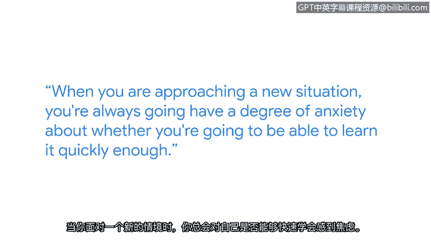

# 012：在网络安全领域学习和成长

在本节课中，我们将跟随谷歌云的首席信息安全官菲尔，了解在快速变化的网络安全领域如何持续学习和成长。我们将探讨学习的心态、方法以及如何构建坚实的知识基础。

大家好，我是菲尔。我是谷歌云的首席信息安全官，我的工作很大一部分当然与网络安全相关。

在网络安全领域，你必须持续学习，必须保持知识更新。根本原因在于技术、业务以及数字生活世界总是在不断变化。你今天使用的在线服务，很可能与12个月前大不相同。

在90年代中期，我曾参与开发世界上最早的网上银行系统之一。当时，我们基本上是自己构建和编写所有的安全代码。我记得我研究过最早的网页浏览器、最早的网页服务器，以及互联网上最早的加密实现。那甚至是在谷歌公司成立之前，处于互联网的萌芽期。我们实际上是一边摸索一边构建，在实践中学习。

## 🧠 从零开始：克服初学者的焦虑

上一节我们了解了网络安全领域日新月异的特性。本节中，我们来看看如何以正确的心态开始学习。

当你初次进入网络安全领域时，重要的是不要被其庞大的范围所吓倒。我们所有人都曾站在你今天的位置，都必须在某个时刻开始学习。

我曾经不了解Linux，不知道如何编程，也不熟悉其他操作系统的各个部分。我必须一步一步地学习所有这些是如何运作的，并随着时间的推移逐渐积累知识。即使是现在，我偶尔也需要查阅资料，因为我无法一次性记住所有东西，这完全没问题。

当你面对一个新领域时，总会对是否能足够快地学会它感到一定程度的焦虑。通常，随着经验的积累，你会逐渐确信自己能够掌握。但同样重要的是要记住，你不必一次性学会所有东西。

## 🛠️ 循序渐进：构建知识体系的方法

了解了正确的心态后，我们来看看具体的学习方法。

大多数时候，你只需要在过程的初始阶段学到足够有价值的知识，然后边做边学。从编写几行简单的代码开始，或者查看别人的代码并尝试理解它的功能，然后稍作修改，逐步深入。

以下是构建知识基础的关键步骤：
*   **从简单开始**：编写几行简单的代码。
*   **观察与理解**：查看他人的代码，理解其功能。
*   **动手修改**：对代码进行小幅修改，观察变化。
*   **逐步深入**：通过增量式学习，不断积累。

通过这种方式构建的知识基础，将使你具备学习其他新事物的能力。我认为，许多事情都将由此生发。

## 📚 总结与回顾

本节课中，我们一起学习了在网络安全领域持续成长的核心要点。

我们首先认识到，由于技术和环境的快速变化，持续学习是网络安全工作的必然要求。接着，我们探讨了如何以平和的心态开始，克服初学者的焦虑，并理解循序渐进的重要性。最后，我们介绍了一种实用的学习方法：从基础入手，通过观察、理解和实践来逐步构建坚实的知识体系。记住，学习是一个积累的过程，强大的基础是未来探索更广阔天地的关键。

