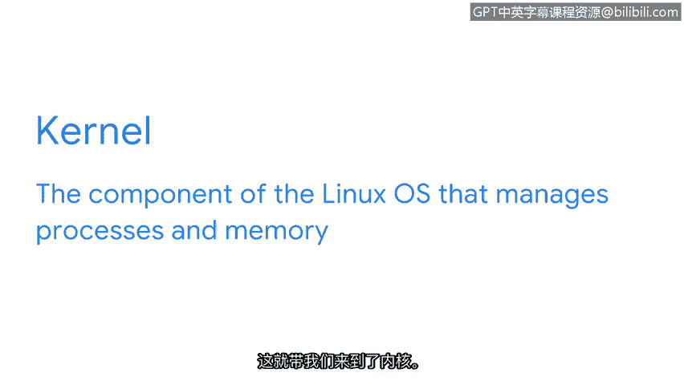

# 013：Linux架构详解

## 概述
在本节课中，我们将学习Linux操作系统的核心架构。我们将逐一解析构成Linux系统的各个组件，了解它们如何协同工作，从而为后续深入学习Linux命令和系统管理打下坚实基础。

---

## 从建筑到系统：理解架构的重要性
让我们从一个看似与安全无关的快速问题开始。你是否有最喜欢的建筑？它的哪个建筑特点最令你印象深刻？是窗户，还是墙体的结构？正如建筑物一样，操作系统也拥有其架构，并由相互协作的离散组件构成一个整体。

在本视频中，我们将详细查看共同构成Linux的所有组件。

## Linux架构的核心组件
Linux的组件包括：用户、应用程序、Shell、文件系统层次标准、内核以及硬件。别担心，我们将逐一深入探讨这些组件。

### 用户：系统的启动者
首先，你是用户。用户是与计算机进行交互的人。在Linux中，你是操作系统架构中的第一个元素。你负责发起操作系统将要执行的任务或命令。

Linux是一个多用户系统。这意味着多个用户可以同时使用系统的资源。

### 应用程序：执行特定任务的程序
架构的第二个元素是系统中的应用程序。应用程序是执行特定任务的程序，例如文字处理器或计算器。你可能会听到“应用程序”和“程序”这两个词互换使用。

举个例子，我们稍后会深入学习的一个流行Linux应用程序是Nano。Nano是一个文本编辑器。这个简单的应用程序帮助你在屏幕上记录笔记。

Linux应用程序通常通过包管理器进行分发。我们将在后续课程中了解更多关于这个过程的内容。

### Shell：用户与系统的沟通桥梁
Linux架构中的下一个组件是Shell。这是一个重要的元素，因为它是你与系统通信的方式。

Shell是一个命令行解释器。它处理命令并输出结果。这听起来可能很熟悉。之前，我们学习了两种类型的用户界面：图形用户界面和命令行界面。你可以将Shell视为一个命令行界面。

### 文件系统层次标准：数据的组织者
Linux操作系统的另一个架构元素是文件系统层次标准。FHS是Linux操作系统中负责组织数据的组件。

理解FHS的一个简单方法是将其想象成一个数据文件柜。FHS是数据在系统中的存储方式。它是一种组织数据的方法，以便在系统访问数据时能够找到它们。

### 内核：进程与内存的管理者
这引出了内核。内核是Linux操作系统的一个组件，负责管理进程和内存。

内核与硬件通信，以执行Shell发送的命令。内核使用驱动程序来使应用程序能够执行任务。Linux内核有助于确保系统更有效地分配资源，并使系统运行得更快。

### 硬件：系统的物理基础
最后，架构的最后一个组件是硬件。硬件指的是计算机的物理组件。你可以将其与可以下载到系统中的软件应用程序进行比较。

你计算机中的硬件包括CPU、鼠标和键盘等。

---

## 总结
恭喜，我们现在已经涵盖了Linux的架构。理解这些组件将帮助你越来越熟悉Linux。在接下来的学习中，我们将基于此架构知识，探索如何通过Shell与系统交互，以及如何管理文件和进程。