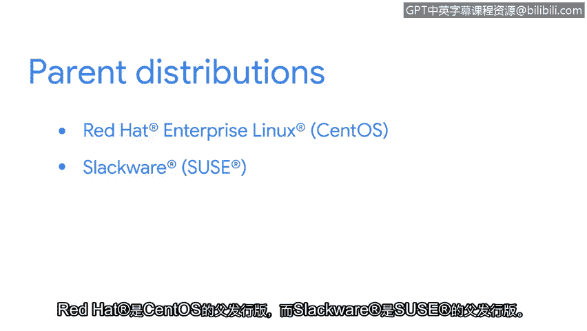

# 014：13_Linux发行版

在本节课程中，我们将深入了解Linux操作系统，并探讨作为一名安全分析师需要掌握的相关知识。我们将重点介绍Linux发行版的概念、特点以及它们在安全工作中的重要性。

Linux是一个高度可定制的操作系统。与其他操作系统不同，Linux有多种版本可供选择。这些不同的Linux版本被称为发行版。

您可能也听说过它们被称为“distros”或Linux的“风味”。理解您所使用的发行版至关重要，因为这决定了您可以使用哪些工具和应用程序。例如，Debian发行版提供的工具就与Ubuntu发行版不同。

## 🚗 理解Linux发行版：一个类比

为了更清晰地描述Linux发行版，我们可以使用一个类比。将操作系统想象成一辆车。

首先，我们从它的引擎开始，这相当于Linux的内核。正如引擎驱动车辆运行一样，内核是Linux操作系统最重要的组成部分。

因为Linux内核是开源的，任何人都可以获取内核并对其进行修改，以构建一个新的发行版。这好比汽车制造商获取一个引擎，然后创造出不同类型的车辆：卡车、轿车、货车、敞篷车、公共汽车、飞机等等。

这些不同类型的车辆可以比作不同的Linux发行版。公共汽车用于运送大量人员，卡车用于长距离运输大量货物，飞机则通过空运运送乘客或货物。正如每种车辆都有其特定用途一样，不同的发行版也因不同原因而被使用。

此外，车辆都有不同的组件来区分彼此。飞机有带按钮和旋钮的控制面板，普通汽车有四个轮胎，但卡车可能有更多。同样，不同的Linux发行版包含不同的预装程序、用户界面等等。这在很大程度上基于Linux用户的需求，但有些发行版的选择也基于个人偏好，就像有人可能选择跑车作为座驾一样。

## 🔧 Linux发行版的构成与优势

使用Linux作为操作系统的一个优势在于其可定制性。

发行版通常包含Linux内核、实用工具、一个包管理系统和一个安装程序。

我们之前了解到，Linux是开源的，任何人都可以为源代码的增补做出贡献。这正是新发行版被创建的方式。所有发行版都派生自另一个发行版，但有几个被认为是“父发行版”。例如，Red Hat是CentOS的父发行版，Slackware是SuSE的父发行版。Ubuntu和Kali Linux都派生自Debian。

## 🛡️ 安全分析师常用的发行版

接下来，我们将看看安全分析师最常用的一些发行版。对这些发行版了解得越多，您的工作就会越轻松。

以下是几个关键的安全相关Linux发行版：

*   **Kali Linux**：这是一个专门为渗透测试和数字取证设计的发行版。它预装了数百种安全工具，如 `nmap`（网络扫描器）、`Wireshark`（网络协议分析器）和 `Metasploit`（渗透测试框架）。
*   **Parrot Security OS**：另一个专注于安全、隐私和开发的发行版。它提供了一个完整的便携式实验室，用于各种网络安全场景。
*   **Ubuntu**：虽然是一个通用发行版，但其庞大的社区、优秀的文档和稳定的软件仓库，使其成为许多安全专业人员的可靠基础系统，可以在此基础上安装所需的安全工具。

## 📝 本节总结

在本节课程中，我们一起学习了Linux发行版的核心概念。我们了解到Linux发行版是包含内核、工具和包管理系统的不同版本，其多样性和可定制性是Linux的一大优势。通过类比车辆，我们理解了不同发行版有不同用途和组件。最后，我们简要介绍了安全分析师常用的几个发行版，如Kali Linux，为后续的实际操作奠定了基础。理解您所使用的发行版，是有效利用Linux进行安全分析工作的第一步。