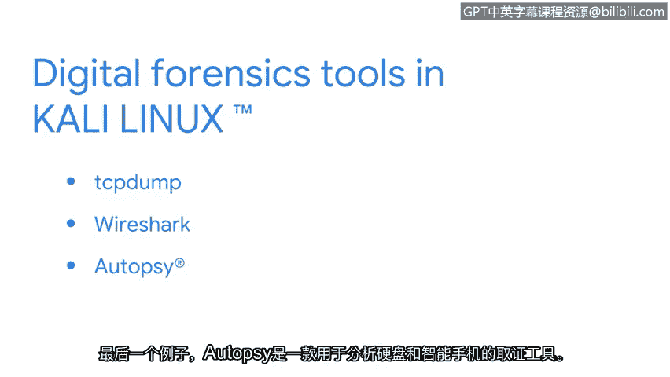

# 015：Kali Linux™ 简介

在本节课程中，我们将介绍一个在安全领域广泛使用的Linux发行版——Kali Linux。我们将了解它的特点、适用场景以及它预装的一些核心工具。

Kali Linux是Offensive Security公司的注册商标，它基于Debian系统开发。这个开源发行版是专门为渗透测试和数字取证而设计的。

## 🛡️ Kali Linux的安全使用环境

上一节我们介绍了Linux发行版的基本概念，本节中我们来看看Kali Linux。首先，必须注意Kali Linux应该在虚拟机环境中使用。这可以防止其工具被不当使用时对您的系统造成损害。使用虚拟机的另一个好处是，它允许您在需要时恢复到之前的安全状态。

## 🔍 Kali Linux在渗透测试中的应用

随着安全专业人员职业生涯的发展，有些人会专攻渗透测试领域。渗透测试是一种模拟攻击，旨在帮助识别系统、网络、网站、应用程序和流程中的漏洞。Kali Linux内置了大量在渗透测试中有用的工具。

以下是其中几个例子：

*   **Metasploit**：可用于查找并利用计算机上的漏洞。
*   **Burp Suite**：帮助测试Web应用程序弱点的工具。
*   **John the Ripper**：用于猜测密码的工具。

## 🕵️ Kali Linux在数字取证中的应用

作为一名安全分析师，您的工作可能涉及数字取证。数字取证是收集和分析数据以确定攻击发生后情况的实践。例如，您可能需要调查与网络活动相关的数据。

Kali Linux对于从事数字取证工作的安全专业人员来说也是一个非常有用的发行版。它包含了大量可用于此目的的工具。

以下是几个常用于数字取证的例子：

*   **Tcpdump**：一个命令行数据包分析器，用于捕获网络流量。
*   **Wireshark**：安全行业中常用的另一个工具，它拥有图形用户界面，可用于分析实时和已捕获的网络流量。
*   **Autopsy**：一个用于分析硬盘驱动器和智能手机的取证工具。

## 📚 总结与过渡

以上仅仅是Kali Linux所包含工具中的几个例子。这个发行版拥有许多用于进行渗透测试和数字取证的工具。

我们已经探讨了Kali Linux为何是一个在安全领域被广泛使用的重要发行版。但是，安全专业人员也会使用其他发行版。接下来，我们将探索另外几个发行版。

在本节课中，我们一起学习了Kali Linux——一个专为安全测试和取证设计的Linux发行版。我们了解了它必须在虚拟机中使用以确保安全，并认识了它在渗透测试（如使用Metasploit）和数字取证（如使用Wireshark）中的关键作用。