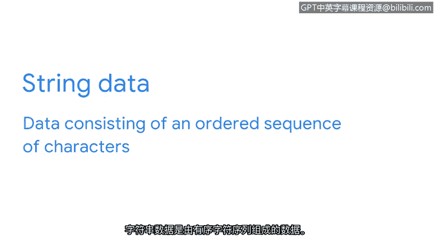
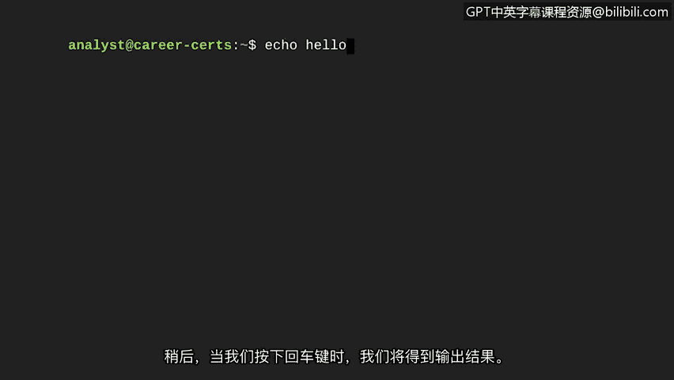
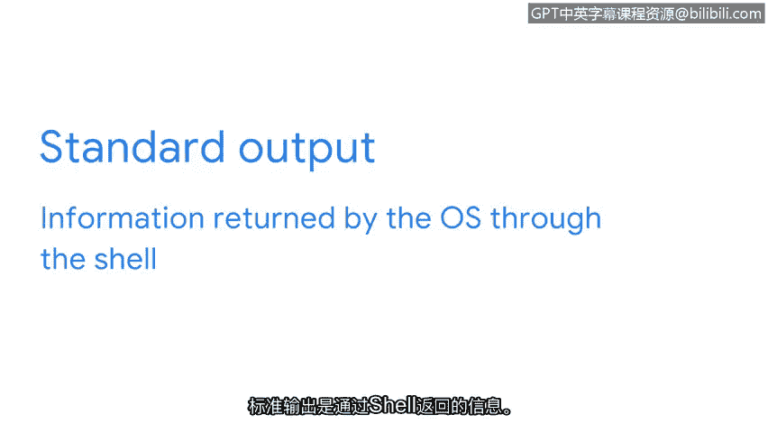
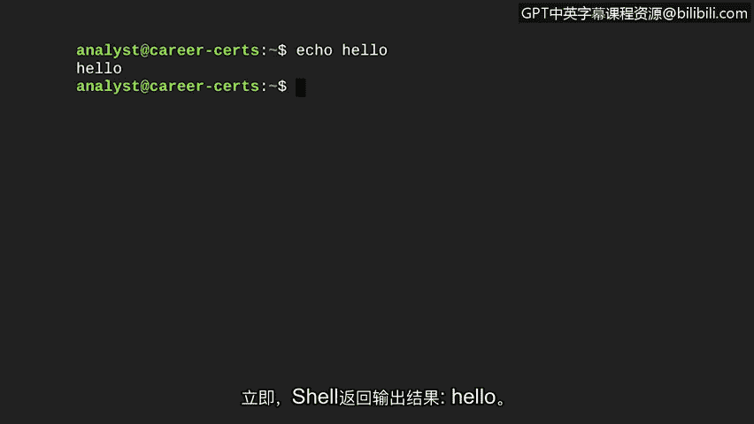
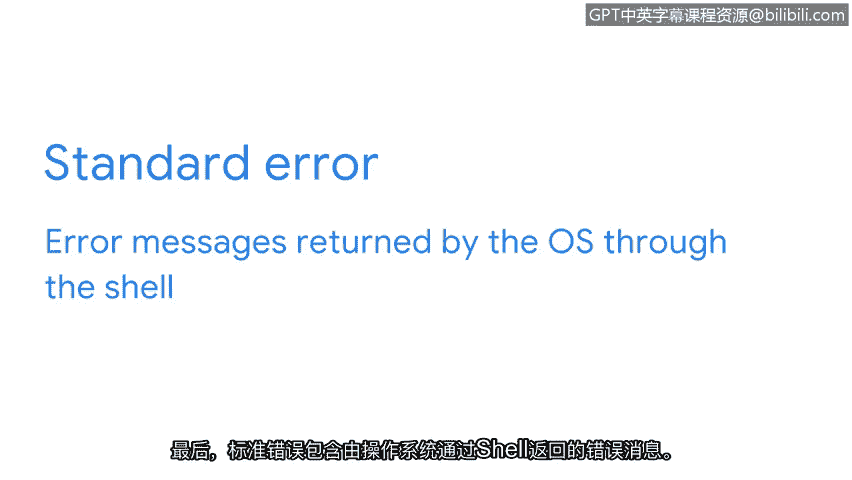
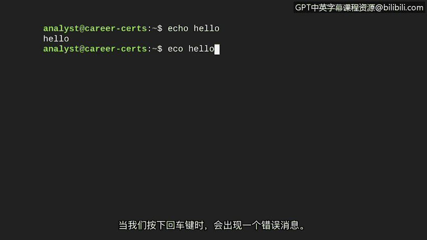

# 017：Shell中的输入和输出

在本节课程中，我们将学习如何与Shell进行交互，具体了解标准输入、标准输出和标准错误。理解这三者是有效使用命令行工具的基础。

与计算机交互就像和朋友对话。一方提出问题，另一方给出回应。如果不知道答案，就直接表示无法回答。同样，Shell中的命令可以接收输入、产生输出或返回错误信息。接下来，我们将详细探讨这些概念。

## 标准输入 📥

标准输入是指操作系统通过命令行接收的信息。这就像在对话中向朋友提问。信息从你的键盘输入到Shell。如果Shell能理解你的请求，它会向内核申请执行相关任务所需的资源。

让我们看一个例子：`echo`是一个Linux命令，用于输出指定的文本字符串。字符串数据是由有序字符序列组成的数据。

在我们的例子中，我们将让它输出字符串“Hello”。因此，作为输入，我们将在Shell中键入 `echo Hello`。稍后，当我们按下回车键时，就会得到输出。但在执行之前，让我们先更详细地讨论输出的概念。

## 标准输出 📤

标准输出是操作系统通过Shell返回的信息。

就像朋友回答你的问题一样，输出是计算机对你输入命令的响应。输出就是你接收到的结果。

现在，让我们继续之前的例子，通过按下回车键将 `echo Hello` 这个输入发送给操作系统。Shell会立即返回输出 `Hello`。

## 标准错误 ❗

最后，标准错误包含操作系统通过Shell返回的错误消息。就像你的朋友可能表示无法回答问题一样，如果系统无法响应你的命令，它也会返回错误消息。

有时，这可能发生在我们拼错命令或系统不知道如何响应命令时。其他时候，也可能因为我们没有执行命令的适当权限。

我们将探索另一个演示标准错误的例子。让我们在Shell中输入 `eccho Hello`。请注意，我故意将 `echo` 拼写为 `eccho`。

当我们按下回车键时，会出现一条错误消息。

## 总结

我们已经介绍了与Shell通信的基础知识。与Shell的通信只能通过以下三种方式进行：
*   **输入**：系统接收命令。
*   **输出**：系统响应命令并产生输出。
*   **错误**：系统不知道如何响应，导致错误。

随着我们后续探索对安全专业人员有用的命令，你会对这些概念更加熟悉。