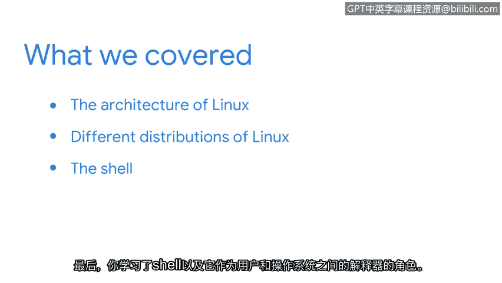

**谷歌网络安全专业证书第四课：《工具之道：Linux与SQL》 - P18：17_总结**

在本节课程中，我们完成了对Linux操作系统基础知识的探索。现在，让我们一起来回顾和总结所学内容。

我们首先探讨了Linux操作系统的整体架构，了解了其核心组件如何协同工作。

随后，我们深入研究了Linux的不同发行版。以下是安全领域中最广泛使用的一些发行版：
*   **Kali Linux**：专为渗透测试和网络安全审计设计。
*   **Ubuntu**：以用户友好和社区支持强大而闻名。
*   **Parrot OS**：一个专注于安全、隐私和开发的发行版。
*   **Red Hat Enterprise Linux (RHEL)**：一款广泛用于企业级环境的商业发行版。
*   **SUSE Linux Enterprise Server (SLES)**：另一款主要面向企业的稳定发行版。

最后，我们学习了**Shell**的概念及其核心作用。Shell是用户与操作系统内核之间的**命令行解释器**，它接收用户输入的命令，并将其转换为系统可以执行的指令。其基本交互模型可以简化为：
`用户输入 -> Shell解释 -> 内核执行 -> 结果输出`

恭喜你完成了本节的学习，你的进展非常出色。我们还有更多实用的主题即将展开。

在接下来的课程中，你将学习作为一名安全分析师，需要在Shell中使用的具体命令。让我们继续前进。