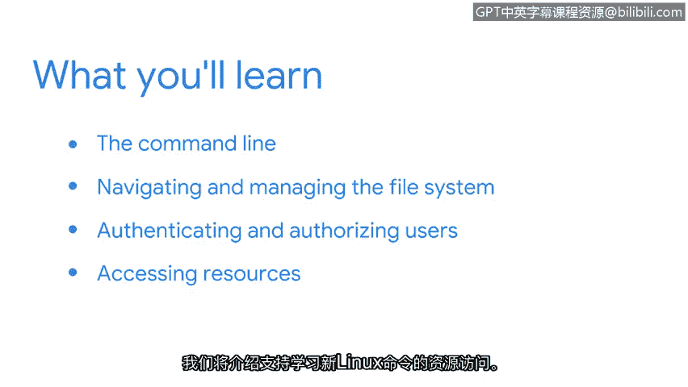

**谷歌网络安全专业证书第四课：《工具之道：Linux与SQL》 - P19：18_欢迎来到第三周**

在本节课中，我们将学习如何通过命令行与Linux操作系统进行交互。我们将介绍核心的Linux命令，重点涵盖文件系统导航、用户认证与授权管理，并了解如何获取资源以学习更多命令。掌握这些技能对于网络安全分析师至关重要。

学习一种新的交流方式令人兴奋。

也许你曾学习一门新语言并记得这种感觉。

或许我们许多人与幼儿词汇量扩展时的兴奋感同身受。

包括我在内的其他人，则记得初次使用专门语言与计算机交流时的新奇感。

上一节我们介绍了Linux的基础，本节中我们将继续深入学习如何通过其Shell与操作系统进行通信。

你将利用命令行与操作系统进行通信。

你将学习如何在Shell中输入命令，并了解作为安全分析师将使用的一些核心Linux命令。

具体而言，这包括导航和管理文件系统。

你还将重点关注用户的认证和授权。

这意味着你将能够使用命令行在系统中添加和删除用户，并控制他们的访问权限。

最后，学无止境，因此我们将介绍如何访问支持学习新Linux命令的资源。

我记得初次了解命令行时，对其提供的强大功能感到震惊。

我不再需要通过点击多个屏幕来完成任务。

尽管需要一些练习和时间来适应。

但它已成为我手中最重要的工具之一。

完成本节学习后，你将获得在使用Linux命令进行安全分析工作这一重要领域的实践经验。

本节课中我们一起学习了如何通过Linux命令行与系统交互，掌握了文件系统操作和用户管理的基础命令，并了解了持续学习的资源。这些是网络安全分析师日常工作的核心工具。