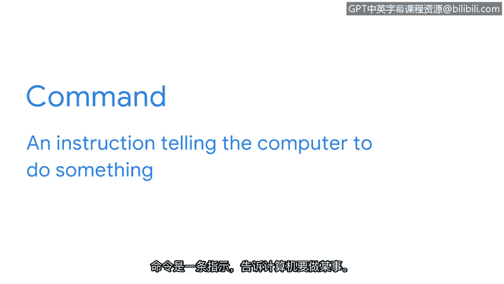
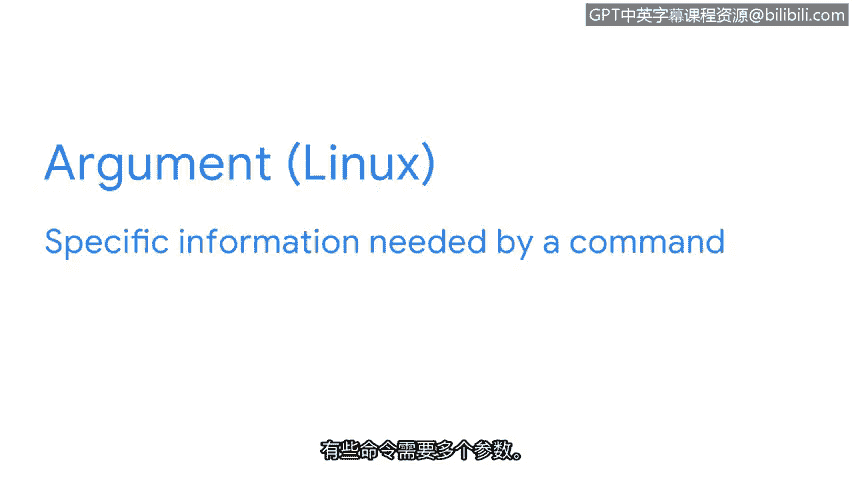
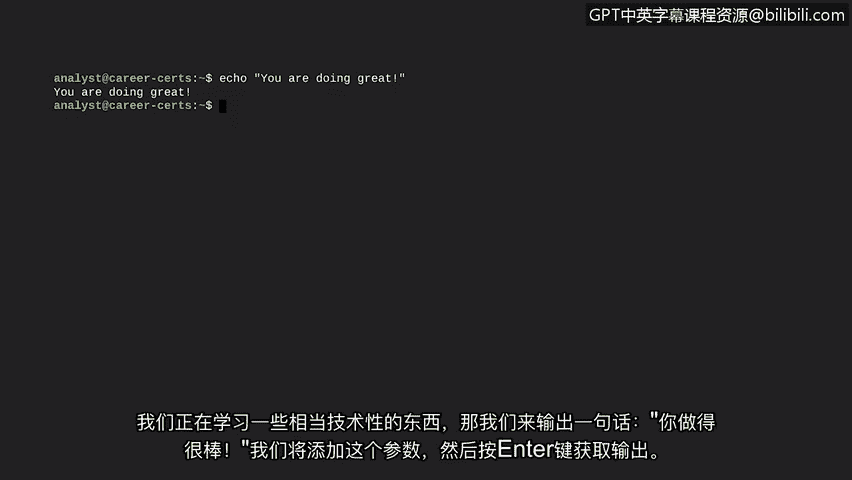

# 020：通过Bash Shell执行Linux命令

欢迎回来。在深入学习具体的Linux命令之前，我们先来更详细地探讨如何通过Shell与操作系统进行通信的基础知识。

对于所有安全专业人员来说，能够使用Linux命令是一项基础技能。作为一名安全分析师，您需要处理服务器日志，并且需要知道如何在没有图形用户界面的情况下远程导航、管理和分析文件。此外，您还需要知道如何在组访问期间验证已配置的用户，以及授予授权和设置文件权限。这意味着，掌握命令行技能对于您作为安全分析师的工作至关重要。

在学习Linux架构时，我们了解到Shell是操作系统的主要组件之一。我们也了解到存在不同的Shell。在本节中，我们将使用Bash。Bash是大多数Linux发行版中的默认Shell。您在本节中将学习的关键Linux命令，在大多数Shell中都是通用的。

现在您知道了将要使用的Shell，让我们来了解如何在Bash中编写命令。正如上一节所讨论的，与操作系统的通信就像一场对话。您输入命令，操作系统则用命令的答案来回应。

命令是告诉计算机执行某项操作的指令。我们将在Bash中尝试一个命令。请注意光标前的美元符号（`$`）。这是提示您输入新命令的提示符。

有些命令可能告诉计算机查找某些内容，例如特定文件。

其他命令可能告诉它启动一个程序，或者输出特定的文本字符串。在上一节讨论输入和输出时，我们探讨了`echo`命令是如何做到这一点的。让我们再次输入`echo`命令。

您可能注意到，我们刚刚输入的命令并不完整。如果我们想使用`echo`命令输出特定的文本字符串，就需要指定该字符串是什么。这就是参数的作用。

参数是命令所需的特定信息。有些命令接受多个参数。现在，让我们用一个参数来完成`echo`命令。

我们正在学习一些相当技术性的东西，那么输出“you are doing great”这句话怎么样？我们将添加这个参数，然后按回车键获取输出。

在这个例子中，我们的参数是一个文本字符串。参数也可以提供其他类型的信息。

在Linux中非常重要的一点是，所有命令和参数都是区分大小写的。这包括文件和目录名。在您作为安全分析师学习如何在日常任务中使用Linux时，请记住这一点。

好的，既然我们已经介绍了通过Shell输入Linux命令和参数的基础知识，现在可以准备学习一些具体的命令了。这很令人兴奋，让我们进入下一个视频。

---

**本节课总结**

在本节课中，我们一起学习了通过Bash Shell与Linux操作系统交互的基础。我们明确了Shell（特别是Bash）在安全分析工作中的核心地位，理解了命令和参数的基本概念，并通过`echo`命令进行了实践。我们特别强调了Linux中命令和参数是**区分大小写**的这一重要特性，为后续学习具体的文件操作和系统管理命令打下了坚实的基础。