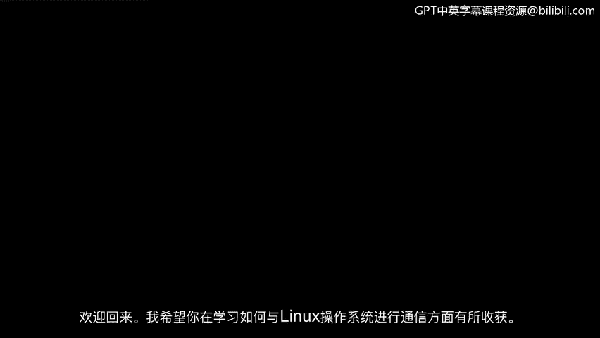
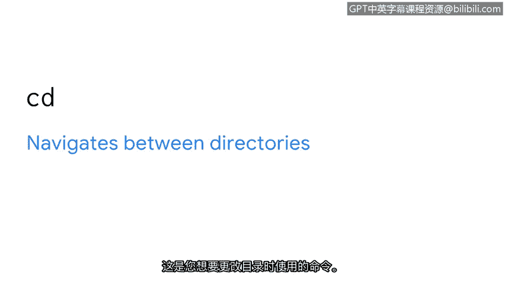
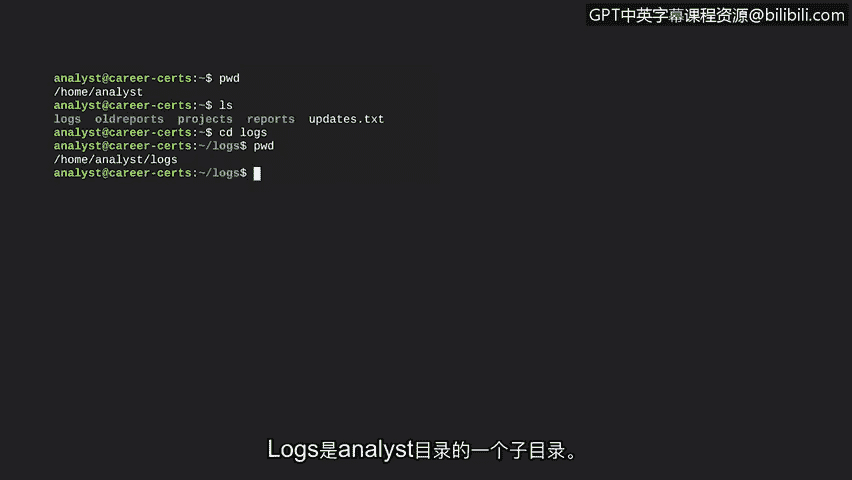
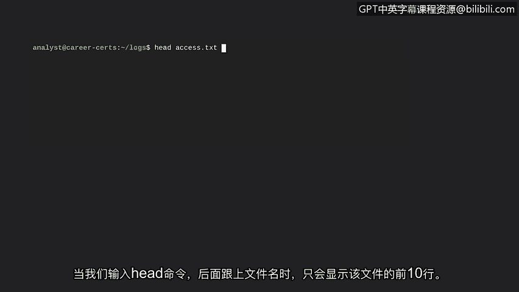

**谷歌网络安全专业证书第四课：《工具之道：Linux与SQL》 - P21：导航和读取文件的核心命令**

在本节课中，我们将学习如何与Linux操作系统进行通信，重点掌握在Linux文件系统中导航以及读取文件内容的核心命令。

---

上一节我们介绍了Linux架构的组成部分。本节中，我们来看看Linux文件系统层次结构标准。FHS是Linux操作系统的一个组件，用于组织数据。这个文件系统是Linux中非常重要的一部分，因为我们在Linux中所做的任何事情，在系统的某个目录中都被视为一个文件。

FHS是一个层次化系统。就像一棵树，所有东西都从根开始生长和分支。根目录是Linux中的最高级别目录，用一个斜杠 `/` 表示。子目录从根目录分支出来。这些子目录进一步分支，离根目录越来越远。

在描述Linux的目录结构时，斜杠用于沿着这些分支回溯到根目录。例如，路径 `/home/anna` 中，第一个斜杠表示根目录。然后它分支到 `home` 子目录。另一个斜杠表示它再次分支，这次是分支到位于 `home` 内的 `anna` 子目录。

在安全领域工作时，学习导航文件系统以定位和分析日志（例如日志文件）至关重要。你将分析这些日志文件以了解应用程序使用情况和身份验证情况。

有了这个背景知识，我们现在可以学习常用于导航文件系统的命令了。

以下是三个核心导航命令：

*   **`pwd`**：将当前工作目录的路径打印到屏幕上。使用此命令时，输出会告诉你当前位于哪个目录。
*   **`ls`**：显示当前工作目录中的文件和目录名称。
*   **`cd`**：在目录之间导航。当你想更改目录时，就使用这个命令。

让我们在Bash中使用这些命令。首先，我们输入命令 `pwd` 来显示当前位置，然后按回车键。输出是到 `analyst` 目录的路径，这是我们当前的工作目录。

接下来，我们输入 `ls` 来显示 `analyst` 目录内的文件和目录。输出是四个目录的名称：`logs`、`old_reports`、`projects` 和 `reports`，以及一个名为 `updates.txt` 的文件。

假设我们现在想进入 `logs` 目录以检查未经授权的访问。我们输入 `cd logs` 来更改目录。`cd` 命令不会在屏幕上产生任何输出。但如果我们再次输入 `pwd`，其输出会表明当前工作目录是 `logs`，它是 `analyst` 目录的一个子目录。

---

作为安全分析师，你还需要知道如何在Linux中读取文件内容。例如，你可能需要读取包含配置设置的文件以识别潜在漏洞，或者在调查未经授权访问时查看用户访问报告。

以下是两个用于读取文件内容的命令：

*   **`cat`**：显示文件的全部内容。这个命令很有用，但有时你并不想查看一个大文件的全部内容。
*   **`head`**：在这种情况下，你可以使用 `head` 命令。它默认只显示文件的开头10行。

让我们试试这些命令。假设我们想读取 `access.txt` 文件的内容，并且我们已经位于该文件所在的工作目录中。

首先，我们输入 `cat` 命令，然后跟上文件名 `access.txt`。Bash会返回这个文件的完整内容。

让我们将其与 `head` 命令进行比较。当我们输入 `head` 命令并跟上文件名时，只显示该文件的前10行。

---

本节课中，我们一起学习了安全分析师如何使用 `pwd`、`ls`、`cd`、`cat` 和 `head` 这些基本命令来导航系统并读取文件内容。这些是进行系统管理和安全调查的基础。接下来，我们将探索如何管理系统。😊