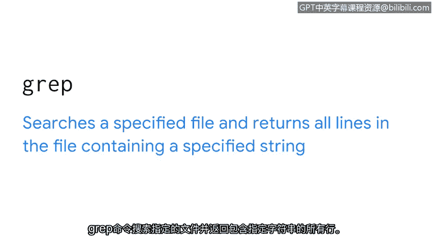
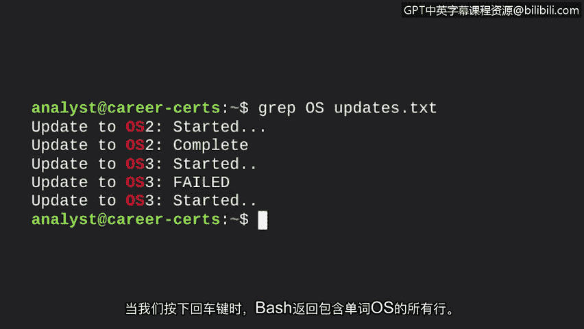
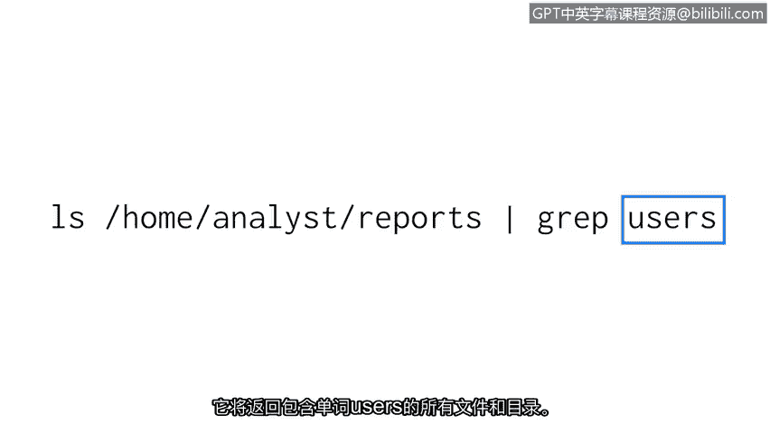
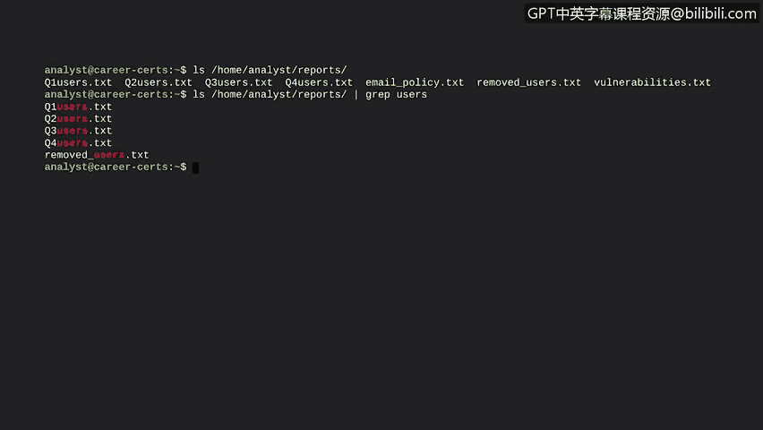

# 022：使用Linux找到所需内容 🔍


在本节课中，我们将学习如何在Linux文件系统中查找所需内容。作为一名安全分析师，过滤信息是解决复杂问题的关键技能。我们将重点介绍两个强大的命令：`grep`和管道（`|`），它们能帮助您高效地搜索和筛选数据。

上一节我们介绍了`pwd`、`ls`和`cd`等基本导航命令，本节中我们来看看如何在系统中进行精确查找。

## 使用 `grep` 命令进行搜索

`grep` 命令用于在指定文件中搜索特定字符串，并返回包含该字符串的所有行。这在处理大型日志或配置文件时尤其有用。

例如，假设您的团队发现一段恶意软件包含特定字符串，您可能需要查找包含相同字符串的其他文件。手动扫描大型文件非常耗时，而 `grep` 可以快速完成此任务。



以下是 `grep` 命令的基本语法：

```bash
grep [搜索字符串] [文件名]
```

*   **第一个参数**是您要搜索的字符串。
*   **第二个参数**是您要搜索的文件名。

假设我们有一个名为 `updates.txt` 的文件，我们需要找到其中所有包含单词 “OS” 的行。命令如下：

```bash
grep OS updates.txt
```



执行后，Bash 将只输出 `updates.txt` 文件中包含 “OS” 的行。

## 使用管道 `|` 进行过滤

管道是Linux中一个多功能命令，其核心思想是将一个命令的标准输出作为另一个命令的标准输入，以便进行进一步处理。在过滤数据的上下文中，它非常强大。

想象一根物理管道：水从一端进入，从另一端流出。Linux管道类似，数据从管道左侧的命令流出，成为管道右侧命令的输入。管道符号是竖线：`|`。

之前我们学习了 `grep` 可以直接搜索文件内容。当 `grep` 与管道结合使用时，它可以对前一个命令的输出结果进行搜索。

以下是一个组合命令示例：

```bash
ls /home/reports | grep users
```

这个命令的执行过程是：
1.  `ls /home/reports` 首先列出 `/home/reports` 目录下的所有文件和子目录。
2.  管道 `|` 将这个列表输出，而不是显示在屏幕上，并将其传递给下一个命令。
3.  `grep users` 接收这个列表，并在其中搜索包含字符串 “users” 的项。
4.  最终，只有名称中包含 “users” 的文件或目录会被显示出来。

## 在Bash中实践

让我们通过一个具体例子来更好地理解这个过滤过程。

首先，我们输出 `reports` 目录中的所有内容。如果不在该目录下，需要指定路径：



```bash
ls /home/analyst/reports
```

假设输出显示有7个文件。现在，我们只想查看文件名中包含 “users” 的文件。我们将使用管道组合 `ls` 和 `grep` 命令：

```bash
ls /home/analyst/reports | grep users
```

执行后，输出将只显示那些文件名包含 “users” 的文件。不包含此字符串的两个文件将从结果中消失。



## 总结

本节课中我们一起学习了在Linux中进行信息过滤的两种核心方法：
1.  **`grep` 命令**：用于在文件内容中直接搜索特定字符串。
2.  **管道 `|`**：用于将一个命令的输出作为另一个命令的输入，常与 `grep` 结合，实现对命令结果的动态过滤。


掌握文件和目录的导航以及内容过滤，是有效使用Linux命令行的基础。作为安全分析师，这些技能将帮助您快速定位日志、配置文件和潜在威胁指标。让我们继续探索Linux命令行的更多功能。