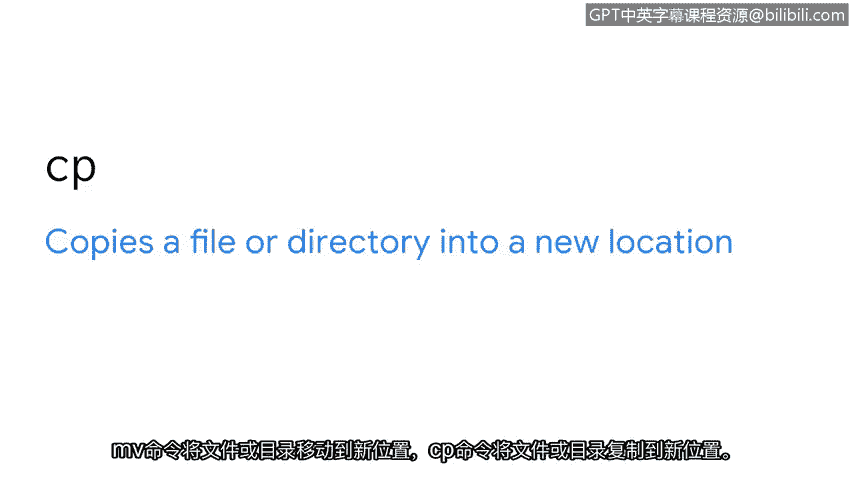
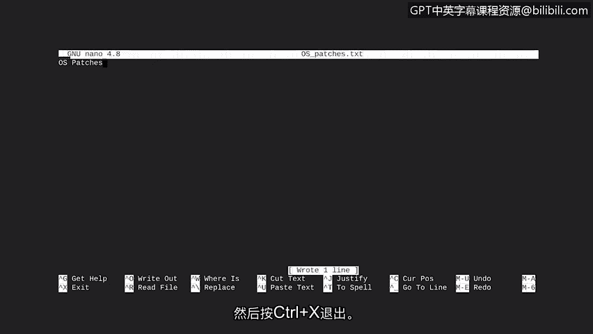

# 023：创建和修改目录和文件

在本节课中，我们将学习如何在Linux系统中创建和修改目录与文件。掌握这些基本操作是有效组织和管理数据的基础，对于网络安全工作至关重要。

上一节我们讨论了根目录和子目录的结构。本节中，我们来看看如何像修剪和培育树木一样，通过命令来创建和管理这些“分支”。

在网络安全领域处理数据时，组织是关键。如果我们知道信息的位置，就能更容易地发现问题并确保信息安全。

在之前的视频中，我们已经讨论了如何在目录之间导航。现在，让我们花点时间更仔细地检查目录。你可能熟悉用文件夹来组织信息的概念。在Linux中，我们使用目录。目录有助于组织文件和子目录。例如，在一个报告目录中，分析师可能需要创建两个子目录，一个用于草稿，另一个用于最终报告。

既然我们知道了为什么需要目录，现在让我们看看一些用于管理目录和文件的基本Linux命令。

以下是用于创建和删除目录的命令：

*   **`mkdir`** 命令创建一个新目录。
*   **`rmdir`** 命令则删除一个目录。这个命令的一个有用特性是它内置了警告功能，当目录非空时会提示你，这可以防止你意外删除文件。

接下来，你将使用其他命令来创建和删除文件。

*   **`touch`** 命令创建一个新文件。
*   **`rm`** 命令则删除一个文件。

最后，我们还有用于复制和移动文件或目录的命令。

*   **`mv`** 命令将文件或目录移动到新位置。
*   **`cp`** 命令将文件或目录复制到新位置。

现在，我们准备好尝试这些命令了。首先，让我们使用 `pwd` 命令查看当前目录。

然后，让我们用 `ls` 命令显示 `analyst` 目录中的文件和目录名称。

假设我们不再需要文件列表中出现的 `old_reports` 目录。让我们看看如何删除它。我们输入 `rmdir` 命令，后面跟上我们想要删除的目录名 `old_reports`。

我们可以使用 `ls` 命令来确认 `old_reports` 已被删除，并且不再出现在内容列表中。

现在，让我们做另一个更改。我们需要一个用于报告草稿的新目录。因此，我们需要使用 `mkdir` 命令，并为此目录指定一个名称 `drafts`。如果我们再次输入 `ls`，会注意到新的 `drafts` 目录已包含在 `analyst` 目录的内容中。

让我们通过输入 `cd drafts` 进入这个新目录。如果我们运行 `ls`，它没有返回任何输出，表明此目录当前为空。但接下来，我们将向其中添加一些文件。

假设我们需要起草关于最近安装的电子邮件和操作系统补丁的新报告。要创建这些文件，我们输入 `touch email_patches.txt`。

然后输入 `touch os_patches.txt`。运行 `ls` 表明这些文件现在已在 `drafts` 目录中。

如果我们意识到只需要一份关于操作系统补丁的新报告，并想删除 `email_patches` 报告，该怎么办？为此，我们输入 `rm` 命令，并指定要删除的文件为 `email_patches.txt`。运行 `ls` 确认它已被删除。

现在，让我们专注于移动和复制命令。我们意识到在 `reports` 文件夹中有一个名为 `email_policy.txt` 的文件目前是草稿格式。因此，我们想把它移动到新创建的 `drafts` 文件夹中。为此，我们需要切换到当前拥有该文件的目录。

在该目录中运行 `ls` 显示它包含几个文件，其中包括 `email_policy.txt`。然后，要移动该文件，我们将输入 `mv` 命令，后跟两个参数。`mv` 后的第一个参数标识要移动的文件。第二个参数指示移动的目标位置。

如果我们切换到 `drafts` 目录，然后显示其内容，会注意到 `email_policy.txt` 文件已被移动到此目录。我们切换回 `reports` 目录。显示文件内容确认 `email_policy.txt` 已不在那里。

还有一件事。`vulnerabilities.txt` 是一个我们希望保留在 `reports` 目录中的文件，但由于它影响一个即将进行的项目，我们也想把它复制到 `projects` 目录中。既然我们已经在这个拥有该文件的目录中，我们将使用 `cp` 命令将其复制到 `projects` 目录中。请注意，第一个参数指示要复制哪个文件，第二个参数提供它将被复制到的目录的路径。

当我们按下回车键时，这会将 `vulnerabilities.txt` 文件复制到 `projects` 目录中，同时将原始文件保留在 `reports` 目录里。用这些命令能做的事情很酷，不是吗？

现在让我们关注与修改文件相关的另一个概念。除了使用命令，你还可以使用应用程序来帮助你编辑文件。作为安全分析师，文件编辑器对于日常任务（如编写或编辑报告）通常是必需的。一个流行的文件编辑器是 `nano`。它很适合初学者。你可以通过 `nano` 命令访问此工具。让我们一起来熟悉一下 `nano`。

我们将为新的草稿报告 `os_patches.txt` 添加一个标题。首先，我们切换到包含该文件的目录。

然后我们输入 `nano`，后跟我们要编辑的文件名 `os_patches.txt`。这会打开 `nano` 文件编辑器并载入该文件。现在，我们只需在编辑器中输入标题“OS Patches”。

我们需要在返回命令行之前保存它，为此我们按 `Ctrl+O`，然后按回车键以当前文件名保存。接着要退出，我们按 `Ctrl+X`。

做得好。我们在这里涵盖了很多主题，从创建和删除目录及文件，到复制、移动它们。就在刚才，我们还添加了编辑文件的操作。你正在顺利掌握Linux命令的道路上。

