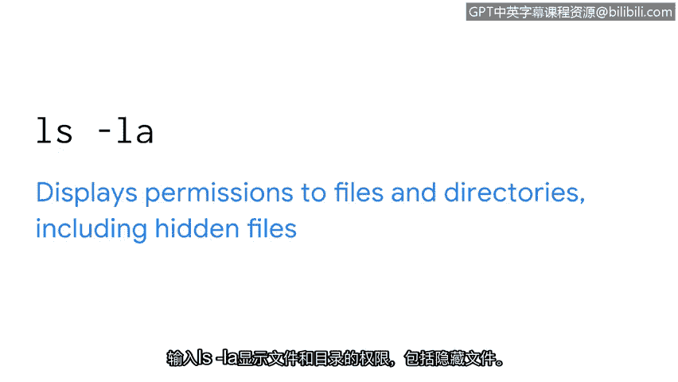
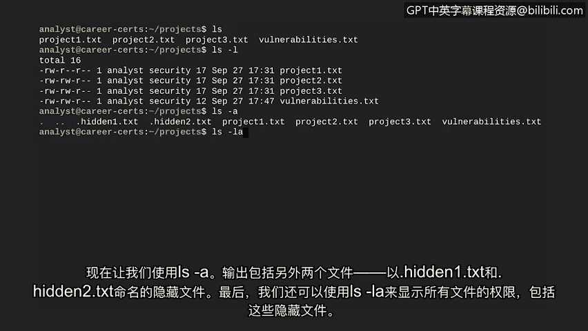

# 024：文件权限与所有权

欢迎回来。在本节课程中，我们将继续学习如何在Linux环境中工作，并重点探讨文件与目录的权限管理。理解权限对于网络安全分析师至关重要，因为它直接关系到系统资源的访问控制和信息保护。

## 🔐 权限与授权概述

上一节我们介绍了Linux的基本操作，本节中我们来看看如何管理文件和目录的访问权限。权限是授予文件或目录的访问类型，它与**授权**概念紧密相关。授权是指授予用户访问系统中特定资源的权限。通过授权，你可以限制对指定文件或目录的访问。

遵循“按需知密”原则来管理数据访问是一个好习惯。试想，如果任何人都能在系统上随意访问或修改任何内容，将会带来多大的安全风险。

## 📖 Linux中的三种权限类型

在Linux中，授权用户可以拥有三种类型的权限。

以下是三种基本权限类型：

1.  **读取权限**：对于文件，意味着可以读取文件内容。对于目录，意味着可以读取该目录下的所有文件列表。
2.  **写入权限**：对于文件，允许修改文件内容。对于目录，表示可以在该目录内创建新文件。
3.  **执行权限**：对于文件，意味着如果该文件是可执行文件，则可以运行它。对于目录，则允许用户进入该目录并访问其中的文件。

## 👥 三种权限所有者

权限会授予三种不同类型的所有者。

以下是三种权限所有者：

1.  **用户**：文件的所有者。创建文件时，你即成为该文件的所有者，但所有权可以更改。
2.  **组**：每个用户都属于某个组。一个组包含多个用户，这是在多用户环境中管理权限的一种方式。
3.  **其他**：指系统上的所有其他用户。基本上，任何能访问系统的其他人都属于此类别。

## 🔢 权限表示法

在Linux中，文件权限用一个10个字符的字符串表示。对于一个用户、组和其他都拥有完全权限的目录，该字符串为：`drwxrwxrwx`。

让我们更仔细地分析这个字符串的含义：

*   **第一个字符**表示文件类型。例如，`d` 表示这是一个目录。如果这个字符是连字符 `-`，则表示它是一个普通文件。
*   **第二到第四个字符**表示**用户**的权限。在示例中，`r` 表示有读权限，`w` 表示有写权限，`x` 表示有执行权限。如果缺少某项权限，则用连字符 `-` 代替字母。
*   **第五到第七个字符**以相同的方式表示**组**的权限。
*   **第八到第十个字符**表示**其他**用户的权限。

为文件和目录设置恰当的访问权限，对于保护敏感文件和维护系统整体安全至关重要。例如，薪资部门处理敏感信息，如果薪资组之外的人可以读取这些文件，就会引发隐私问题。另一个例子是当用户、组和其他人都能写入一个文件时，这种文件被称为**全局可写文件**，可能带来重大的安全风险。

## 🔍 如何检查权限

了解了权限的基本概念后，我们来看看如何实际查看它们。首先需要理解什么是**选项**。选项用于修改命令的行为，可以是一个字母或一个完整的单词。

检查权限涉及为 `ls` 命令添加选项。

以下是用于检查权限的常用 `ls` 命令选项：

*   `ls -l`：以长格式列出文件和目录，并显示其权限信息。
*   `ls -a`：显示所有文件，包括隐藏文件（以点 `.` 开头的文件）。
*   `ls -la`：结合上述两个选项，显示所有文件（包括隐藏文件）的详细信息及其权限。

让我们进入Bash环境尝试这些选项。假设我们当前在 `project` 子目录中。

首先，使用 `ls` 命令显示目录内容。输出显示了目录中的文件，但我们不知道它们的权限信息。

通过使用 `ls -l`，我们获得了这些文件的扩展信息。现在文件名显示在每行的右侧。每行的第一个信息块就是我们之前讨论过的权限格式。由于这些都是文件而非目录，请注意第一个字符是连字符 `-`。

让我们聚焦于一个特定文件 `project1.txt`。其权限字符串的第二到第四个字符（`rw-`）显示**用户**拥有读和写权限，但没有执行权限。在第五到第七个字符和第八到第十个字符的位置，序列都是 `r--`。这意味着**组**和**其他**用户只有读权限。

在权限信息之后，`ls -l` 首先显示用户名（例如 `analyst`），接着是组名（例如 `security`）。

现在使用 `ls -a`。输出中包含了两个额外的文件：名为 `.hidden1.txt` 和 `.hidden2.txt` 的隐藏文件。

最后，我们也可以使用 `ls -la` 来显示所有文件（包括这些隐藏文件）的权限。

## 📝 本节总结

本节课中，我们一起学习了Linux中文件权限与所有权的基础知识。你现在对文件权限的表示方法（如 `drwxrwxrwx`）、三种权限类型（读、写、执行）以及三种所有者（用户、组、其他）有了更深入的了解。同时，我们掌握了使用 `ls -l`、`ls -a` 和 `ls -la` 命令来检查文件和目录权限的方法。

这些知识在安全工作中非常有用，因为监控和设置正确的权限对于保护信息至关重要。休息一下，我们下一个视频再见。

