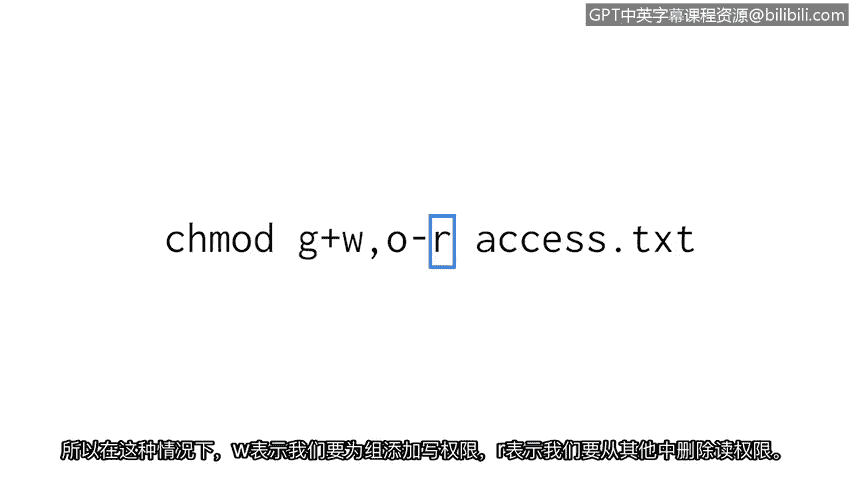
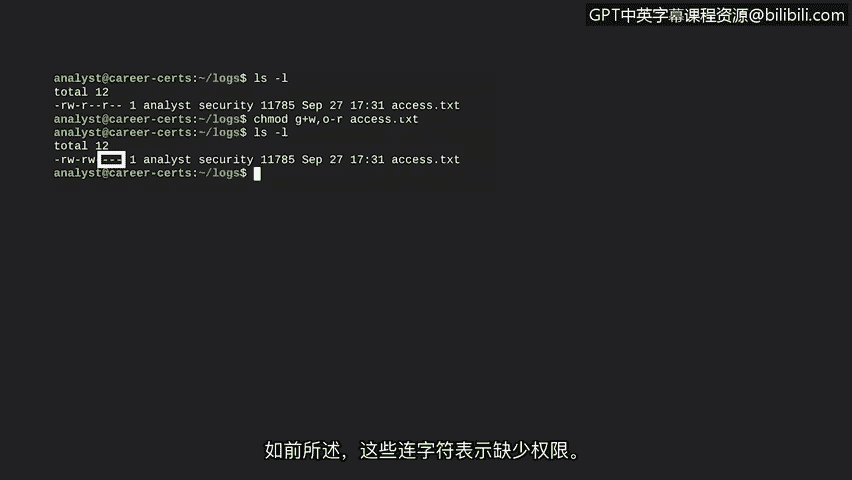

# 025：24_更改权限


## 概述

在本节课中，我们将学习如何更改Linux系统中文件和目录的权限。作为安全分析师，调整用户权限是保护系统文件免遭意外或恶意修改的关键任务。

上一节我们介绍了如何检查用户的权限。本节中，我们来看看如何使用 `chmod` 命令来实际更改这些权限。

## 理解 `chmod` 命令

`chmod` 命令用于更改文件和目录的权限。其名称代表“Change mode”（更改模式）。更改权限有两种模式，但我们将重点学习**符号模式**。

了解 `chmod` 工作原理的最佳方式是通过一个例子。虽然命令看起来包含很多细节，但我们可以将其分解。请记住，与许多Linux命令一样，您无需死记硬背所有信息，随时可以查阅参考。

以下是 `chmod` 命令的一个示例：
```bash
chmod g+w,o-r access.txt
```

让我们来分解这个命令的各个部分。

## 分解 `chmod` 命令参数

使用 `chmod` 时，您需要指定要调整权限的文件或目录。这是命令的最后一个参数，在本例中是名为 `access.txt` 的文件。

紧跟在 `chmod` 命令后的第一个参数指明了如何更改权限。这被称为符号模式。

以下是该命令各组成部分的详细说明：

1.  **所有者类型标识符**：
    *   我们之前学过三种所有者类型：用户（user）、组（group）和其他（other）。
    *   在 `chmod` 中，我们用 `u` 代表用户，`g` 代表组，`o` 代表其他。
    *   在本例中，`g` 表示我们将对**组**的权限进行更改，`o` 表示将对**其他**的权限进行更改。这两个标识符用逗号分隔。

2.  **操作符**：
    *   我们是想添加还是移除权限？为此，我们使用数学运算符。
    *   `+` 号表示添加权限，`-` 号表示移除权限。
    *   在本例中，`g` 后面的 `+` 表示我们要为**组**添加权限，`o` 后面的 `-` 表示我们要从**其他**移除权限。

3.  **权限类型**：
    *   我们已经学过，`r` 代表读权限，`w` 代表写权限，`x` 代表执行权限。
    *   在本例中，`w` 表示我们为组**添加**写权限，`r` 表示我们从其他**移除**读权限。

因此，命令 `chmod g+w,o-r access.txt` 的整体含义是：为文件 `access.txt` 的所属组添加写权限，同时移除其他用户的读权限。



虽然一开始看起来很复杂，但分解后理解起来就容易多了。记住，您不需要记住所有内容。

## 实践操作：更改权限

现在让我们尝试运行这个新命令。我们将从 `log` 子目录开始。

首先，使用 `ls -l` 命令查看当前目录下文件的权限信息：
```bash
ls -l
```
输出将显示该目录中唯一文件 `access.txt` 的权限。

之前我们学过如何解读这些权限：
*   第2到第4个字符表明**用户**拥有读和写权限（`rw-`）。
*   第5到第7个字符表明**组**只有读权限（`r--`）。
*   第8到第10个字符表明**其他**只有读权限（`r--`）。

我们的目标是调整这些权限：确保安全组的分析师拥有写权限，同时移除其他类型所有者的读权限。因此，我们需要为组添加写权限，并为其他移除读权限。

运行 `chmod` 命令：
```bash
chmod g+w,o-r access.txt
```

现在，再次运行 `ls -l` 命令来查看更改：
```bash
ls -l
```
输出显示 `access.txt` 的权限已发生变化。

请注意权限字符串中的变化：
*   在代表**组**权限的中间段（第5-7位），`w` 已被添加，赋予了写权限。
*   另一个变化是，在代表**其他**权限的最后一段（第8-10位），`r` 已被移除。
*   如前所述，连字符 `-` 表示缺乏相应权限。现在，“其他”用户没有任何权限（`---`）。

## 总结



在本节课中，我们一起学习了如何使用 `chmod` 命令的符号模式来更改Linux系统中文件和目录的权限。我们分解了命令的语法，理解了如何指定所有者类型（`u`, `g`, `o`）、操作符（`+`, `-`）和权限类型（`r`, `w`, `x`），并通过一个实践例子巩固了所学知识。虽然需要练习才能熟练，但随着时间推移，在Linux中工作会变得越来越自然。掌握权限管理是维护系统安全的重要基础。

