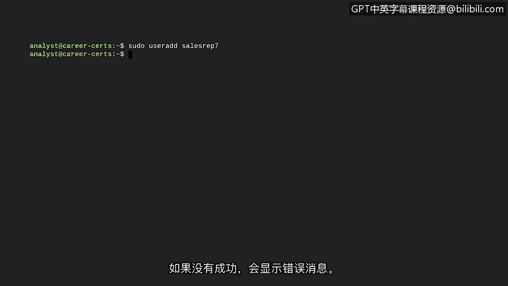
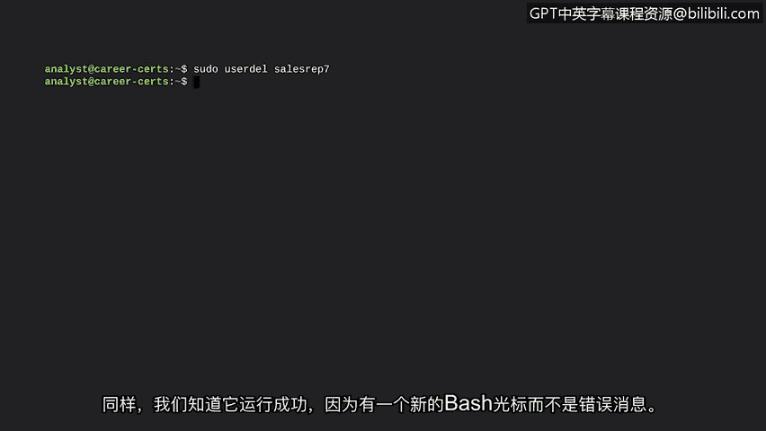

# 026：添加和删除用户 👥


在本节课中，我们将要学习如何在Linux系统中添加和删除用户。这是系统管理中的一项基础且关键的任务，直接关系到系统的访问控制和安全性。

## 概述：用户管理与身份验证

上一节我们介绍了Linux的基本操作，本节中我们来看看用户管理。添加和删除用户与**身份验证**的概念相关。身份验证是用户向系统证明其身份的过程。就像进入一栋实体大楼一样，并非所有用户都应被允许进入系统。我们需要确保不应访问系统的人无法访问，同时，应访问系统的人能够顺利访问。这就是为什么我们需要添加用户。

新用户可能是组织的新成员，或是需要加入新小组的现有成员。这可能是由于组织结构变动，或仅仅是管理层的调动指令。同样，当用户离开组织时，需要将其删除。他们不应再拥有系统的任何访问权限。如果用户只是更换了小组，也应从他们不再属于的小组中删除。

## 超级用户：root

在了解如何操作用户之前，我们需要先认识一种特殊类型的用户：**root用户**（或称超级用户）。root用户是一个拥有修改系统的高级权限的用户。普通用户的权限有限，而root用户则没有这些限制。需要执行特定任务的个人可以被临时添加为root用户。root用户可以创建、修改或删除任何文件，并运行任何程序。**只有root用户或拥有root权限的账户才能添加新用户**。

你可能会想，如何成为超级用户？一种方法是直接以root用户身份登录。但在Linux中，以root身份运行命令被视为不良实践。

### 为何以root身份运行命令可能存在问题？

以下是三个主要问题：

1.  **安全风险**：恶意攻击者会试图攻破root账户，因为这是最强大的账户。为了保持安全，root账户应禁用登录功能。
2.  **易犯不可逆错误**：在命令行界面中很容易输错命令。如果以root身份运行，你犯下不可逆错误（例如永久删除目录）的风险更高。
3.  **责任归属问题**：在Linux这样的多用户环境中，用户众多。如果一个用户以root身份运行命令，将无法追踪到底是谁执行了该命令。

## 解决方案：sudo命令

一个有助于解决上述问题的方案是使用 **`sudo`** 命令。`sudo`是一个临时授予特定用户提升权限的命令。与root用户运行所有命令都拥有root权限相比，`sudo`提供了一种更受控的方法。它解决了以root身份运行所带来的许多问题。

`sudo`源自“Superuser do”。它允许你以提升权限的用户身份执行命令，而无需登录或退出另一个账户。运行`sudo`会提示你输入当前登录用户的密码。**并非系统上的所有用户都能成为超级用户**。用户必须通过一个名为 **`sudoers`** 的配置文件被授予`sudo`访问权限。

## 添加用户：useradd命令

现在我们已经了解了`sudo`，让我们学习如何将其与另一个命令结合来添加用户。这个命令就是 **`useradd`**。`useradd`用于向系统添加一个用户。**只有root用户或拥有`sudo`权限的用户才能使用`useradd`命令**。

让我们看一个具体的例子。假设销售部门新加入一名代表，他将获得用户名`sales_rep_7`。我们的任务是将他添加到系统中。

以下是添加新用户的步骤：

1.  首先，我们需要使用`sudo`命令。
2.  接着是`useradd`命令。
3.  最后是要添加的用户名，本例中是`sales_rep_7`。


完整的命令如下：
```bash
sudo useradd sales_rep_7
```
此命令执行后通常不会在屏幕上显示任何内容。但由于我们得到了一个新的bash提示符（光标）而没有错误信息，我们可以确信命令已成功执行。如果失败，则会出现错误信息。有时错误可能很简单，比如拼错了`useradd`，或者可能是因为我们没有`sudo`权限。

## 删除用户：userdel命令



现在，让我们学习如何执行相反的操作：使用 **`userdel`** 命令删除用户。`userdel`用于从系统中删除一个用户。同样，我们需要通过`sudo`获得的root权限来使用`userdel`命令。

回到我们刚才添加用户的例子。假设两个月后，我们刚添加到系统中的销售代表离开了公司。该用户不应再拥有系统访问权限。

以下是删除该用户的步骤：


1.  同样，首先使用`sudo`命令。
2.  接着是`userdel`命令。
3.  最后是要删除的用户名。

完整的命令如下：
```bash
sudo userdel sales_rep_7
```
再次，我们知道命令成功运行，因为出现了新的bash提示符且没有错误信息。



## 总结

本节课中我们一起学习了如何在Linux系统中添加和删除用户。我们了解到这些操作都需要使用`sudo`来获取必要的权限。我们探讨了root用户的概念及其潜在风险，并介绍了`sudo`命令作为更安全、可控的替代方案。最后，我们实践了使用`useradd`和`userdel`命令的具体步骤。在使用`sudo`时，我们必须运用最佳判断力，负责任地使用这些特殊权限，以确保系统的安全。