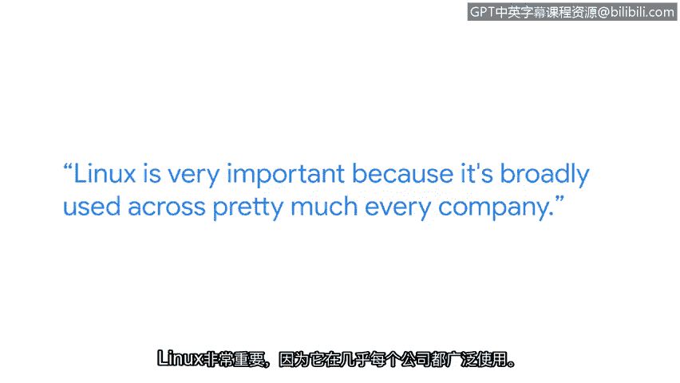

# 027：Linux与SQL

## 概述
在本节课中，我们将跟随谷歌安全工程师达玛尔的分享，了解他学习Linux命令的旅程与心得。我们将探讨Linux在网络安全领域的重要性、学习过程中的挑战与策略，以及可用的支持资源。

## 达玛尔的学习背景与职业路径

我的名字是达玛尔，我是谷歌的一名安全工程师。

我从小就一直想进入网络安全领域。我看过的很多卡通片里都有软盘或闪存驱动器，角色们将其插入电脑就能引发混乱。我一直觉得这非常酷。

在来到谷歌之前，我做过不少工作。我最开始是在Jamba Juice制作冰沙。后来，我在Geek Squad找到了第一份与IT技术相关的工作，最终来到这里成为了一名安全工程师。

## 给网络安全新手的建议

对于那些试图进入网络安全领域的人，我的建议是：这可能比你想象的要容易得多。

这绝对比我想象的要容易。我自己跳入这个领域后学到的一点是：你无法一次性学会所有东西，也不需要一次性知道所有东西。

## Linux的重要性与用途

上一节我们了解了进入网络安全领域的心态，本节中我们来看看一个关键工具：Linux。

Linux非常重要，因为它几乎被每一家公司广泛使用。

以下是Linux在安全工作中的两个常见用途：
*   你可能使用Linux来整理日志。这是一种非常常见的做法。
*   你可能还会使用Linux编写bash脚本作业，以帮助完成Linux内的例行任务。

## 达玛尔与Linux的结缘

我最初对学习Linux产生兴趣是源于电影《侏罗纪公园》。电影中有一个场景，他们需要重新激活电控门，为此必须使用Unix操作系统。后来，我了解了Unix是什么，以及Linux是如何从它衍生而来的。这激励我去学习更多关于Linux的知识。

## 学习Linux命令的实用建议

了解了Linux的起源后，我们来看看如何有效地学习它。

我能给那些试图学习Linux和Linux命令的人的最好建议是：不要因为出现任何小挫折而气馁。坚持下去。

把它想象成你第一次学游泳。你可能并不擅长，过程令人沮丧，你可能还有点害怕，但你坚持了下来。我希望你现在已经会游泳了。

## 可用的学习支持资源

面对学习挑战时，善用资源至关重要。以下是学习Linux时可利用的一些支持资源：
*   证书课程中的讨论论坛是一个很好的例子。
*   另一个学习Linux的支持途径是使用Stack Overflow来谷歌搜索答案。
*   甚至可以在Reddit上发帖求助。

## 网络安全工作的意义

我非常热爱网络安全工作。知道我和我的团队，以及谷歌所有其他的安全团队，正在帮助保护人们在网络上免受他们可能甚至不知道的威胁，这非常令人满足。

## 总结
本节课中，我们一起学习了安全工程师达玛尔进入网络安全领域和学习Linux的历程。我们明确了Linux在行业中的核心地位，获得了坚持学习、克服挫折的鼓励，并了解了论坛、搜索引擎等实用的支持资源。最后，我们也看到了网络安全工作保护他人的重要价值。