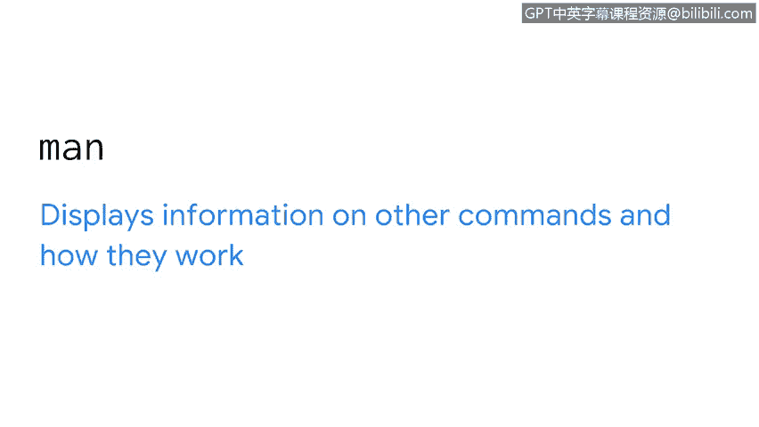
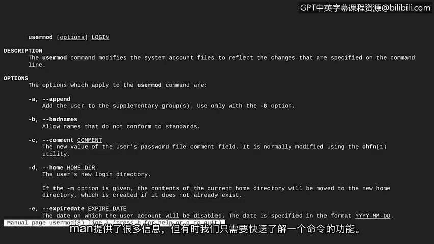
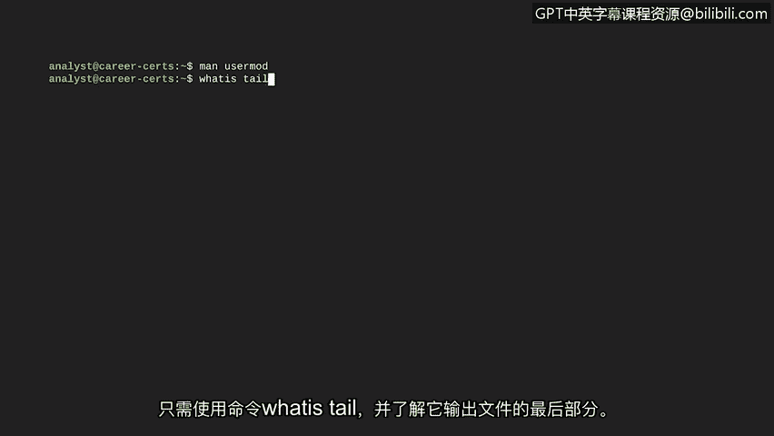
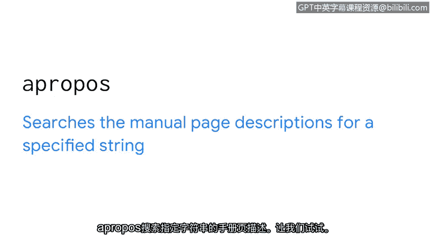
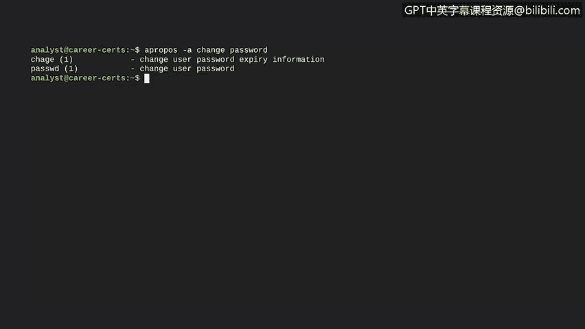

# 029：Shell内的man手册 📖

在本节课程中，我们将学习如何直接在Shell中使用内置的帮助资源，这些工具能帮助你在Linux环境中更高效地工作。Linux系统的一个优点是，你可以通过命令行直接获取帮助信息。

## 使用 `man` 命令获取详细手册

首先介绍的命令是 `man`，它用于显示其他命令的详细信息和工作方式。该命令的名称来源于单词“manual”（手册）。

让我们通过使用 `man` 来获取关于 `usermod` 命令的信息，以便更深入地了解其用法。输入命令 `man usermod` 后，`man` 会返回的信息包括对该命令的总体描述，以及关于 `usermod` 各个选项的详细说明。例如，选项 `-D` 可以添加到 `usermod` 命令中来更改用户的主目录。

`man` 命令提供了大量信息，但有时我们只需要快速了解某个命令的基本功能。

## 使用 `whatis` 命令获取简要说明

在这种情况下，可以使用 `whatis` 命令。`whatis` 会在单行中显示对命令的描述。

假设你听到同事提到了一个名为 `tail` 的命令，但你从未听说过它。你可以通过输入 `whatis tail` 来快速了解它的作用，从而得知该命令用于输出文件的末尾部分。

## 使用 `apropos` 命令搜索相关命令

有时，我们甚至不知道该查找哪个命令。这时，`apropos` 命令就能派上用场。`apropos` 会在手册页描述中搜索指定的字符串。

让我们尝试一下。假设你有一个需要更改密码的任务，但不太确定如何操作。如果我们使用 `apropos` 命令并指定字符串“password”，这将显示大量包含该单词的命令。这虽然有所帮助，但可能仍然难以找到我们真正需要的内容。

不过，我们可以通过添加 `-a` 选项和另一个字符串来过滤结果。此选项将仅返回同时包含这两个字符串的命令。在我们的例子中，既然我们想要更改密码，就让我们同时搜索包含“change”和“password”的命令。现在，`apropos` 的结果已被限制在最相关的命令范围内。

这些命令使得在Linux命令行中导航和查找信息变得容易得多。

## 总结

本节课我们一起学习了三个重要的Shell内置帮助工具：`man`、`whatis` 和 `apropos`。作为网络安全领域的新分析师，你不可能随时知道所有答案，但学会如何快速找到这些答案至关重要。掌握这些命令将帮助你在Linux环境中更自信、更高效地解决问题。