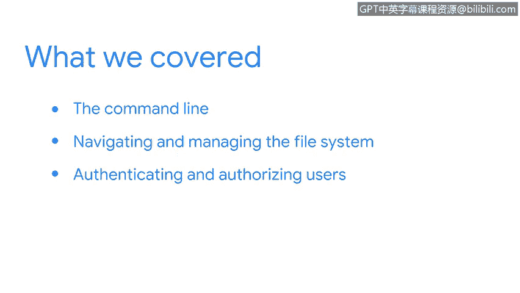

# 030：29_总结

## 概述
在本节课程中，我们将回顾并总结在Linux命令行界面学习过程中所掌握的核心知识与技能。

## 课程内容回顾
上一节我们介绍了如何利用命令行与操作系统进行交互。本节中，我们来总结一下所涵盖的关键内容。

在本节课程中，你学习了大量关于Linux命令行的知识。以下是本节涵盖的核心要点：

*   你学习了使用命令行与操作系统进行通信。
*   你掌握了用于导航和管理文件系统的命令。
*   你学会了使用其他命令进行用户身份验证和授权。

这些都是一名安全分析师很可能遇到的任务。最后，你还了解了如何获取资源以支持学习新的Linux命令。凭借这些知识，你将能够持续深入地学习如何使用命令行。

## 学习成果总结
我们学会了如何与Linux系统进行通信。这是一项重大的成就，并且对你未来作为安全分析师的职业生涯将非常有用。

你应该为截至目前所完成的工作感到自豪。

## 总结
本节课中，我们一起学习了与Linux命令行交互的基础，包括文件系统操作、用户权限管理以及如何自主扩展命令行知识。这些技能是网络安全分析工作的重要基石。