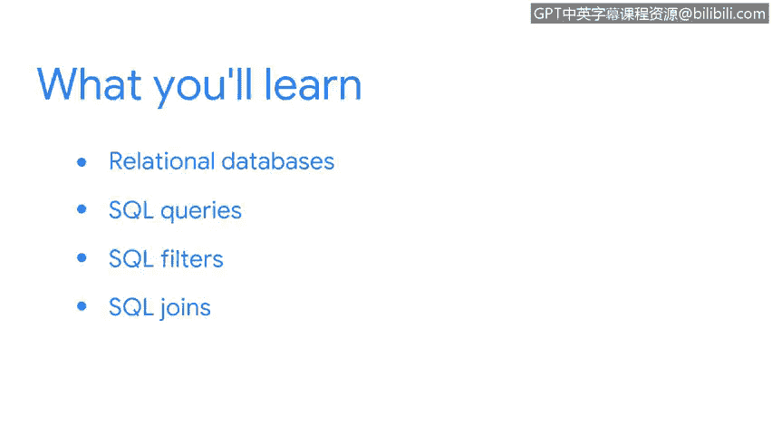

**谷歌网络安全专业证书第四课：《工具之道：Linux与SQL》：4：欢迎来到第四周**

在本节课中，我们将要学习一种新的数据分析工具：SQL。我们将了解什么是关系型数据库，如何编写SQL查询来访问数据，如何使用过滤器精确查找信息，以及如何通过连接操作合并多个数据表。

在安全领域，多样性很重要。找到有效的解决方案通常需要多样化的视角。

我们使用的工具也是如此。你的工作将经常要求你使用多种不同的工具。

在上一节中，我们学习了Linux命令行，了解了这个工具如何帮助你搜索和过滤数据、浏览Linux文件系统以及验证用户身份。

现在，在本节中，我们将学习另一个工具。我们将探索SQL，以及它如何让你以安全分析师角色所需的方式分析数据。

我们将从学习关系型数据库及其结构开始。

接下来，我们将介绍SQL查询以及如何使用它们从数据库中访问数据。

然后，我们将学习SQL过滤器，它帮助我们优化查询以获取所需的确切信息。

最后，我们将探索SQL连接操作，它允许你将多个表组合在一起。

当我在工作中遇到问题或项目时，我经常需要筛选大量数据。当我使用SQL时，我能够快速审查数据并自信地提供结果，因为查询语句是统一且易于执行的。

SQL是一个非常强大且灵活的工具。在本节中，你将学习作为安全分析师所需掌握的部分，并获得实践经验。

祝你好运，我将在后续课程中与你一同学习。😊

**总结**

本节课我们一起学习了SQL在安全分析中的重要性。我们概述了本节的学习路径：从关系型数据库基础开始，到编写SQL查询、应用过滤器进行精确搜索，最后学习如何连接多个数据表。SQL作为一种强大而灵活的工具，将帮助你高效地处理和分析安全数据。