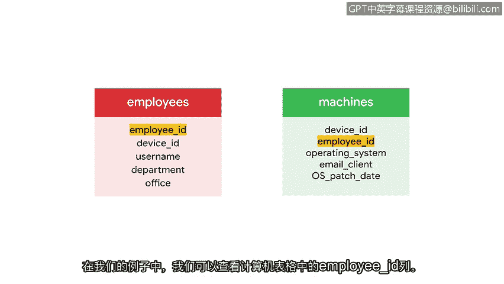

# 032：数据库简介 🗄️

在本节课中，我们将要学习数据库的基础知识。我们将了解什么是数据库、它与电子表格的区别，以及关系型数据库是如何通过表和键来组织数据的。

我们的现代世界充满了数据，这些数据几乎总是在指导我们做出重要决策。当处理大量数据时，我们需要知道如何存储它，以便数据组织有序，并能快速访问和处理。解决这个问题的方案就是数据库，这正是我们将在本视频中探讨的内容。

首先，我们可以将数据库定义为信息或数据的有组织集合。

## 数据库与电子表格

数据库常与电子表格进行比较。你们中的一些人可能过去使用过 Google Sheets 或其他常见的电子表格程序。虽然这些程序是存储数据的便捷方式，但电子表格通常是为单个用户或小团队存储较少数据而设计的。相比之下，数据库可以被多人同时访问，并且可以存储海量数据。数据库在访问数据时还能执行复杂的任务。

作为安全分析师，您经常需要访问包含有用信息的数据库。例如，这些可能是包含登录尝试信息、软件和更新信息，或机器及其所有者信息的数据库。

既然我们知道了数据库的重要性，接下来让我们谈谈它们是如何组织的，以及我们如何与它们交互。

## 关系型数据库的结构

使用数据库使我们能够存储大量数据，同时保持快速和易于访问。构建数据库有很多不同的方式，但在本课程中，我们将使用关系型数据库。关系型数据库是一种包含相互关联的表格的结构化数据库。

让我们进一步了解关系型数据库的构成。我们将从检查一个大型组织信息数据库中的单个表开始。

每个表都包含信息字段。例如，在这个关于员工的表中，字段将包括员工ID、设备ID和用户名等。这些是表的列。

此外，表包含行，也称为记录。记录中填充了与表中列相关的具体数据。例如，我们的第一行是一条记录，对应一名ID为1000、在市场部工作的员工。

关系型数据库通常有多个表。考虑一个例子，我们从一个更大的数据库中获取两个表：一个包含公司员工，另一个包含分配给这些员工的机器。

## 表之间的关系：键

如果两个表共享一个共同的列，我们就可以连接它们。在这个例子中，我们通过一个共同的员工ID列在它们之间建立关系。将两个表相互关联起来的列称为键。键有两种类型。

以下是两种主要类型的键：

*   **主键**：主键指的是每一行都有唯一条目的列。主键不能有任何重复值或任何空值。主键使我们能够唯一地标识表中的每一行。对于员工表，员工ID就是一个主键。每个员工ID都是唯一的，并且没有重复或为空的员工ID。
*   **外键**：外键是一个表中的列，该列是另一个表中的主键。与主键不同，外键可以有空值和重复值。外键允许我们将两个表连接在一起。在我们的例子中，我们可以查看机器表中的员工ID列。我们之前已将其确定为员工表中的主键，因此我们可以用它来将每台机器连接到其对应的员工。

同样重要的是要注意，一个表只能有一个主键，但可以有多个外键。

## 总结与下一步

掌握了这些信息，我们就可以开始学习SQL的基础知识了，SQL是让我们能够处理数据库的语言。在本节的后续部分，我们将亲身体验并实践刚刚学到的这些概念。

在本节课中，我们一起学习了数据库的基本概念，包括其定义、与电子表格的区别，以及关系型数据库如何通过表、记录、主键和外键来组织和关联数据。