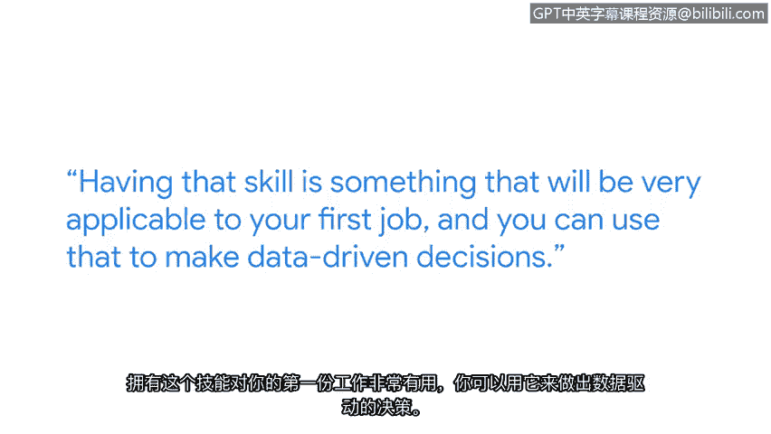

# 034：网络安全中的SQL

## 📚 课程概述
在本节课中，我们将跟随谷歌安全工程师阿黛代奥，了解SQL在网络安全领域的重要性、学习路径以及实践经验。你将明白为什么SQL是网络安全专业人士工具箱中的必备技能，以及如何通过实践来掌握它。

---

## 🧑‍💻 个人背景与入门鼓励
大家好，我是阿黛代奥，目前在谷歌担任安全工程师。

许多人认为，进入网络安全领域需要拥有计算机科学学位。我认为事实并非如此。以我为例，我的IT学习之旅始于尼日利亚的拉各斯，那是我出生和成长的地方。如今，我来到了硅谷，为谷歌工作。我认为这非常了不起，是梦想成真。你正在学习的这个证书，是你承诺将职业转向网络安全的第一步。为你喝彩。

---

## 🔑 SQL在网络安全中的核心价值
上一节我们了解了非科班背景也能进入网络安全领域，本节中我们来看看SQL技能的具体价值。

SQL是你作为网络安全专业人士工具箱中必须掌握的技能之一。掌握SQL后，你不仅能快速做出决策，更能用数据支撑你的决策，并能向你的团队和利益相关者清晰地解释决策依据。仅仅说“我们需要这样做”是一回事；而说“我们需要这样做，这是基于我通过SQL查询得到的数据”则是另一回事，后者更具说服力。

---

## 🛠️ SQL的学习路径与实践方法
了解了SQL的重要性后，我们来看看如何有效地学习并掌握它。

我最初在学校的一门课程中学习了SQL，那是一次很棒的学习经历。但毕业后，我几乎忘记了所有内容。我采取的下一步是参加在线课程，就像你现在正在做的一样，重新学习SQL的基础知识和实际应用方法。

我第一次实际应用SQL是在谷歌。**实践至关重要**。我认为，和其他任何事情一样，熟能生巧。因此，即使每周只抽出几个小时，也要留出时间练习编写SQL语句。这项技能对你获得第一份工作将非常实用，你可以用它来做数据驱动的决策。

---

## 💼 网络安全工作的成就感
最后，我们来谈谈掌握这些技能后，从事网络安全工作带来的满足感。

在网络安全领域工作让我感到非常充实。我每天上班都充满活力，不仅因为我能处理非常复杂的问题并尝试找出解决方案，还因为我拥有优秀的同事，我们能齐心协力攻克难题。晚上入睡时，我知道我的工作是为了让谷歌用户和员工更安全，这对我来说是一种非常有回报的感觉。

---

## 📝 课程总结
本节课中，我们一起学习了网络安全专家阿黛代奥分享的经验。我们了解到SQL是支撑数据驱动决策、进行有效沟通的关键技能；学习SQL需要结合课程学习与持续实践；最终，在网络安全领域运用这些技能解决问题，能带来巨大的职业成就感与满足感。