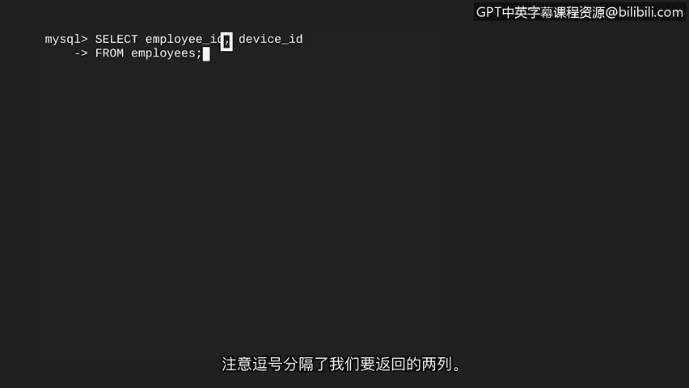
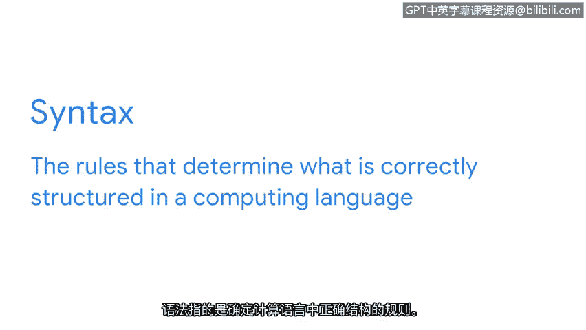
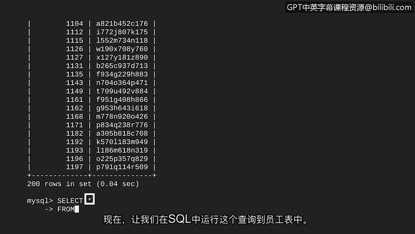

# 035：基本查询


在本节课中，我们将学习如何运行你的第一个SQL查询。这个查询将基于网络安全分析师可能遇到的一项常见工作任务：确定特定员工被分配了哪台计算机。我们将从基础开始，了解构成SQL查询的核心关键字和语法。

## 从任务到查询

假设我们有权访问一个名为 `employees` 的表，该表包含五列。其中，`employee_id` 和 `device_id` 这两列包含了我们需要的信息。我们的目标是编写一个查询，仅从该表中返回这两列数据。

## SQL核心关键字：SELECT 与 FROM

编写基本SQL查询需要两个核心关键字：**SELECT** 和 **FROM**。
*   **SELECT** 指示要返回哪些列。
*   **FROM** 指示要从哪个表中查询数据。

这些关键字在SQL中的使用方式与日常用语非常相似。例如，你可以请朋友“从（**FROM**）大箱子里挑选（**SELECT**）苹果和香蕉”。SQL的思维逻辑与此一致。

现在，让我们在SQL中使用 `SELECT` 和 `FROM` 来获取关于员工及其所用计算机的信息。


## 编写你的第一个查询

以下是获取员工ID和设备ID的SQL语句：

```sql
SELECT employee_id, device_id
FROM employees;
```

我们来分解一下这个语句：
1.  语句以 `SELECT` 开头，后面跟着我们想要返回的列名：`employee_id` 和 `device_id`。
2.  两个列名之间用**逗号**分隔。
3.  `FROM` 关键字指定了数据来源的表：`employees`。
4.  整个语句以**分号**结束。

运行此查询后，输出结果将为我们提供匹配员工与其计算机所需的信息。恭喜，你已经成功运行了第一个SQL查询！



## 关于SQL语法的要点

在继续之前，有必要了解一些SQL语法的关键方面。语法决定了在计算语言中什么是结构正确的。



以下是两个重要注意事项：
*   **大小写不敏感**：SQL关键字不区分大小写。`SELECT` 和 `select` 是等效的。然而，通常将关键字大写以提高查询语句的可读性。
*   **语句结束符**：分号 `;` 应放在语句的末尾，用以标记一个SQL命令的结束。

## 查询所有列：SELECT *

如果我们需要获取更多信息，例如员工所属的部门、用户名或办公地点，该怎么办？我们可以让SQL打印出表中的所有列。

这可以通过在 `SELECT` 后使用星号 `*` 来实现，这通常被称为 **SELECT ALL**。

以下是查询 `employees` 表中所有列的语句：

```sql
SELECT *
FROM employees;
```



运行此查询，输出结果将显示完整的表格。

## 总结

本节课中，我们一起学习了SQL的基础查询操作。我们了解了如何使用 **SELECT** 和 **FROM** 这两个核心关键字从特定表中提取指定的列数据，也掌握了使用 `*` 来快速选择所有列的方法。同时，我们认识了SQL语法中关于大小写和分号使用的基本规则。


你已经成功完成了基础SQL查询的学习！在下一个视频中，我们将学习如何为查询添加过滤器，以便更精确地获取所需数据。